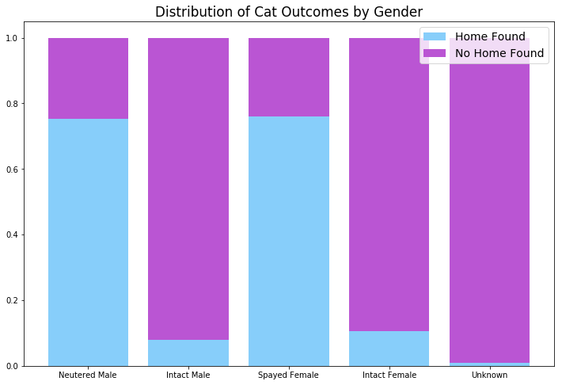
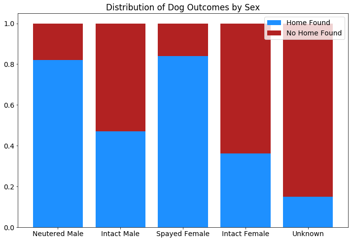
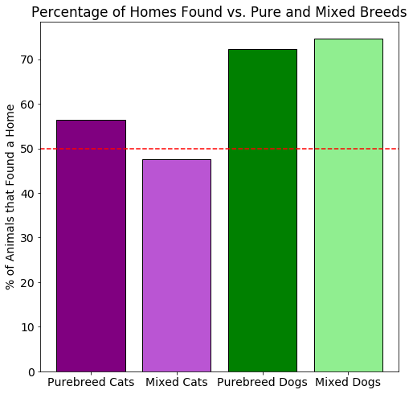
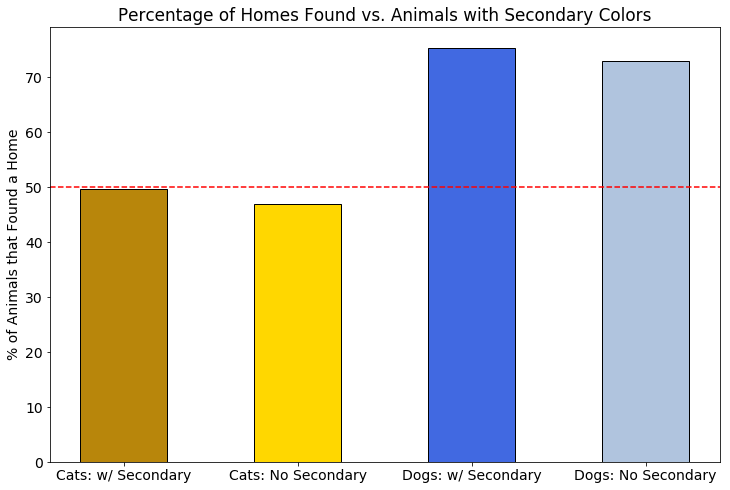
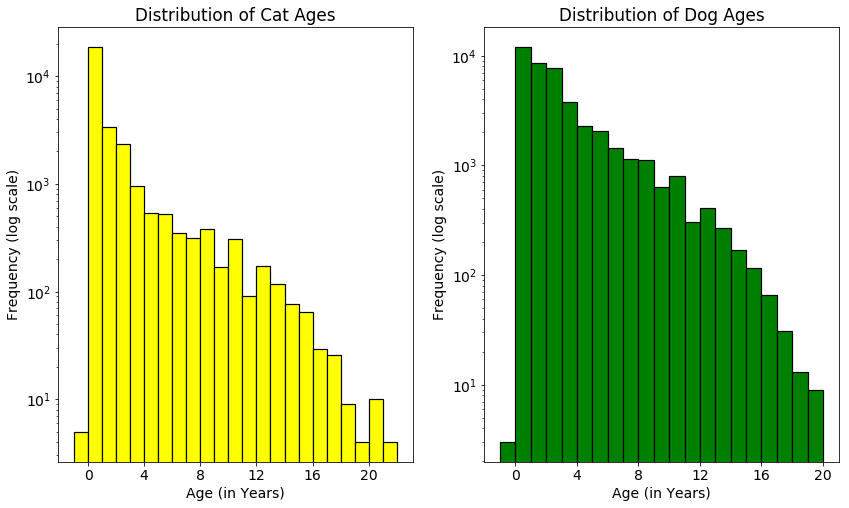
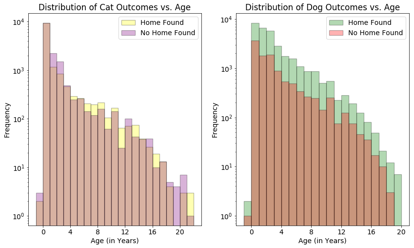
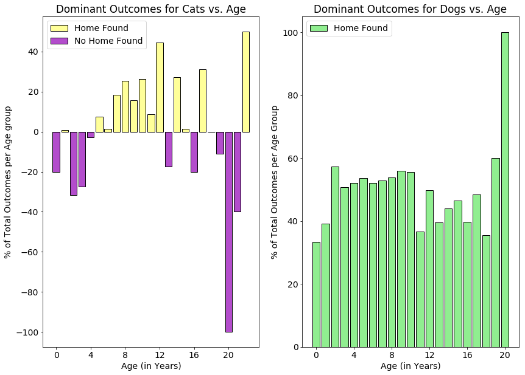
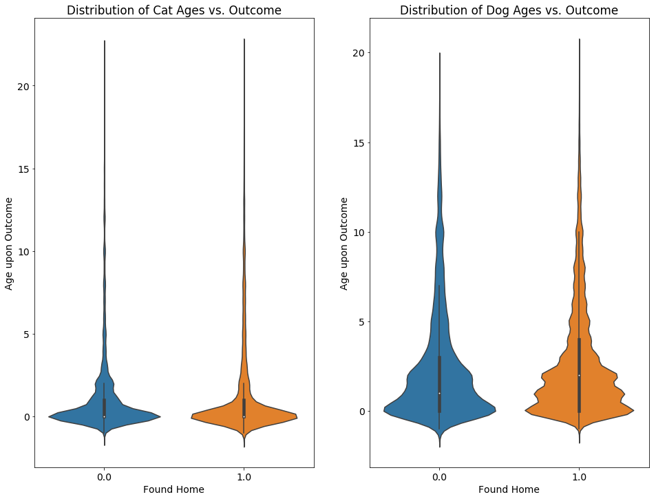

# Understanding Factors in Animal Shelter Pet Adoption - Inferential Statistics

In efforts to understand trends in pet adoption outcomes, the Austin Animal Center has provided data relating to the pets in their adoption center. Understanding this data and using it to model the factors that influence pet adoption could lead to recommendations that improve the performance of the center and help more pets find homes.

### Objective

In this project I will be exploring the data and using visualizations to answer some basic questions, including:

   1. Are there any factors that seem to be statistically significant with respect to the outcome for cats and dogs?
   
First I will begin by importing the necessary packages for analysis, as well as the dataset that was cleaned and formatted **[here](https://github.com/emenriquez/Springboard-Coursework/blob/master/Capstone%20Project%201/Data%20Wrangling%20-%20Pet%20Adoption%20V2.ipynb)**

### Analysis that was performed

In this project I explored some key statistical information for several of the dependent variable features in my dataset against a binary outcome of whether or not the outcome result was placement in a permanent home. Permanent home placement was classified for all pets as being adopted, as well as for those which were lost and successfully returned to their owners.

The notebook with code used to produce this report is available **[here](https://github.com/emenriquez/Springboard-Coursework/blob/master/Capstone%20Project%201/Inferential%20Statistics%20-%20Pet%20Adoption.ipynb)**

The main features explored here are:

    i. Animal Type (Cats vs. Dogs)
    ii. Gender (Male vs. Female)
    iii. Breed (Purebreed vs. Mixed)
    iv. Color (Coat with Only Primary Color vs. Coats with Secondary Color)
    v. Age

#### i. Cats vs. Dogs

It is very important to understand the general distributions of outcomes for cats and dogs, as well as the total number of each that the center recieves, in order to efficiently provide resources to shelter these animals. This section will break down the outcomes for both cats and dogs in order to gain more insight into the placement of these animals in permanent homes.

    # of Cat entries: 28691
    # of Dog entries: 42854
    fraction of Cat entries: 0.4010
    fraction of Dog entries: 0.5990
    Percent of successful placement in permanent homes for all entries: 63.82 %
    Percent of successful callbacks for Cat entries: 47.82 %
    Percent of successful callbacks for Dog entries: 74.53 %
    Margin of Error: 0.0037
    p value via proportion comparison test: 0.00000
    

We can see here that dogs are much more likely to have an outcome resulting in a permanent home than cats. The statistical analysis confirms that this feature is significant to predicting the feature of interest.

#### ii. Gender (Male vs. Female)

    # of Male entries: 35802
    # of Female entries: 33021
    fraction of Male entries: 0.5004
    fraction of Female entries: 0.4615
    Percent of successful placement in permanent homes for all entries: 63.82 %
    Percent of successful callbacks for Male entries: 66.89 %
    Percent of successful callbacks for Female entries: 65.59 %
    Margin of Error: 0.0037
    p value via proportion comparison test: 0.00040
    

Naturally, since animals are spayed and neutered when possible at animal shelters, most adoptions occur for these types rather than intact gender animals. Although the plots of outcomes for male and females in the cases of both cats and dogs seem to show that there is not a strong preference for either gender, the statistical analysis still successfully rejects the null hypothesis. The statistical analysis above confirms that gender is also a influencing factor in whether or not animals are place in a permanent home.

#### iii. Breed (Mixed vs. Pure)

We will next test to see whether or not there is a bias in preference for animals that are either purebred or mixed for adoption.

We can see that there are two opposing trends for cats and dogs here. For cats, purebreeds have a noticeably higher rate of adoption, while dogs see a drop in adoption rates for those that are not mixed breeds. This may be related to the high occurences of Domestic Shorthair cats at the center. When people come in to browse for pet adoption, it is easier for purebreeds to stand out in appearance when most cats are similar. The distribution of breeds for dogs are much more varied, and so this may not have the same impact on adoptions for dogs.

We can test the statistical significance of purebreed vs. mixed animals on outcome as well:

    # of Mixed entries: 67907
    # of Pure entries: 3638
    fraction of Mixed entries: 0.9492
    fraction of Pure entries: 0.0508
    Percent of successful placement in permanent homes for all entries: 63.82 %
    Percent of successful callbacks for Mixed entries: 63.52 %
    Percent of successful callbacks for Pure entries: 69.41 %
    Margin of Error: 0.0082
    p value via proportion comparison test: 0.00000
    

#### iv. Colors (with Secondary Color vs. Without)

Since we have indications so far that less common or exotic animal appearances may positively influence whether or not they are adopted, it would be a good idea to check whether or not the outcome may depend on if the animal has a mixed color coat.

The data above shows that for both cats and dogs, a secondary color seems to slightly improve the rates of adoption. Animals with distinctive color combinations in their coats may stand out more visually to potential pet owners. In order to verify this for all animals, statistical tests are carried out below:

    # of Primary Color Only entries: 33693
    # of Secondary Color entries: 37852
    fraction of Primary Color Only entries: 0.4709
    fraction of Secondary Color entries: 0.5291
    Percent of successful placement in permanent homes for all entries: 63.82 %
    Percent of successful callbacks for Primary Color Only entries: 58.56 %
    Percent of successful callbacks for Secondary Color entries: 68.50 %
    Margin of Error: 0.0036
    p value via proportion comparison test: 0.00000
    

#### v. Age

We can also look at age distribution of both cats and dogs to see the effect of age on permanent home placement.

The plots above show that while all age groups seem to have a higher frequency of dogs that are placed/returned to their homes, cats have a more complicated distribution. Both young (< 5 years old) and old (> 12 years old) seem to have mixed chances of being placed in a permanent home.

One interesting note is that in both cases, the oldest animals seem to have higher chances of adoption.

### Closing Remarks

In this project the Austin Animal Center dataset was investigated with a wide range of metrics to suggest which factors seem to influence the animals that are able to be placed in permanent homes vs. those which are not. It was shown that dogs have a much higher placement rate overall than cats, while attributes such as gender, breed and color seem to have a statistically significant influence on the placement rates for both cats and dogs.

### Thanks for Reading!
