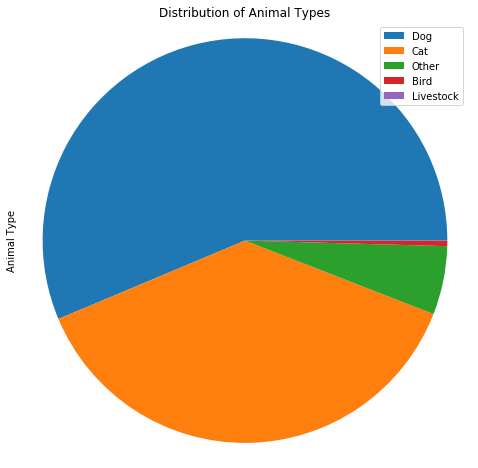
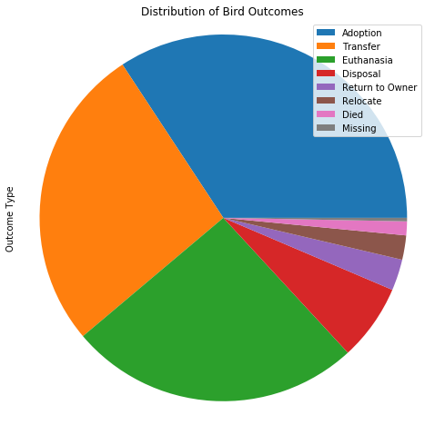
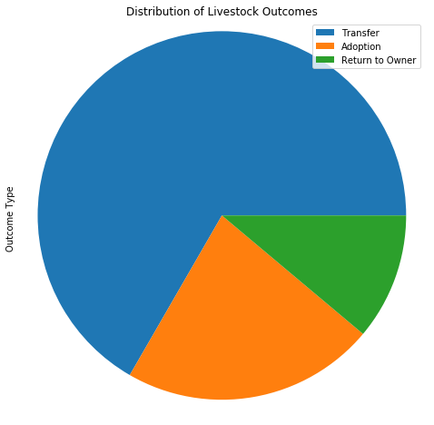
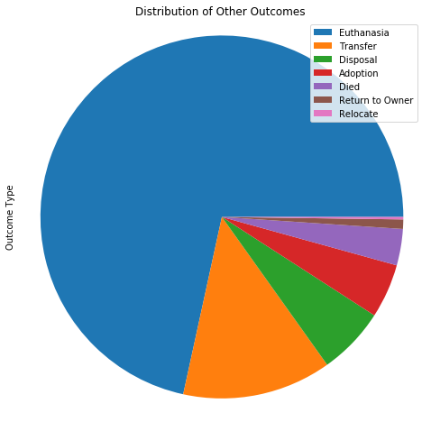

# Understanding Factors in Animal Shelter Pet Adoption - Data Wrangling

In efforts to understand trends in pet adoption outcomes, the Austin Animal Center has provided data relating to the pets in their adoption center. Understanding this data and using it to model the factors that influence pet adoption could lead to recommendations that improve the performance of the center and help more pets find homes.

### Objective

In this project I will be exploring the dataset and using various data wrangling techniques to prepare the data via basic data wrangling techniques in order to prepare the data for analysis. This will include the following steps:

   1. Loading the data and extracting general info and structure
   2. Verifying that data is tidy
   3. Identifying & dealing with missing values
   4. Identifying & dealing with outliers

### 1. Data Info and Structure

First I will start by loading the required packages, as well as the dataset which can be found **[here](https://data.austintexas.gov/Health-and-Community-Services/Austin-Animal-Center-Outcomes/9t4d-g238)**

**Note:** This dataset is updated hourly, and was accessed on Sunday, December 12th 2017 at 19:00 UTC for this project.


```python
# For working with dataframes and manipulation
import pandas as pd

import matplotlib.pyplot as plt
```


```python
# Load the dataset locally
data = pd.read_csv('data/Austin_Animal_Center_Outcomes.csv')
```


```python
# Display number of entries and features in the data
print('# of entries in this dataset: {0}'.format(data.shape[0]))
print('# of features per entry: {0}'.format(data.shape[1]))
```

    # of entries in this dataset: 76133
    # of features per entry: 12
    


```python
# Display general information on dataset
data.info()
```

    <class 'pandas.core.frame.DataFrame'>
    RangeIndex: 76133 entries, 0 to 76132
    Data columns (total 12 columns):
    Animal ID           76133 non-null object
    Name                52741 non-null object
    DateTime            76133 non-null object
    MonthYear           76133 non-null object
    Date of Birth       76133 non-null object
    Outcome Type        76123 non-null object
    Outcome Subtype     35280 non-null object
    Animal Type         76133 non-null object
    Sex upon Outcome    76131 non-null object
    Age upon Outcome    76123 non-null object
    Breed               76133 non-null object
    Color               76133 non-null object
    dtypes: object(12)
    memory usage: 7.0+ MB
    

There are a few details to mention here. Firstly we can see that within our 12 columns, there seem to be some missing entries in several of the columns, which may need to be addressed later on. In addition, all of the row types are classified as 'object', which can most likely be handled more efficiently if we are able to parse out specific types such as the 'DateTime' column. This column can be handled with much more functionality if we are able to convert it to a Datetime object in our dataframe.

In order to get more information, we will preview the first few rows of the data.


```python
# Display first 10 entries
data.head(10)
```


<div>
<table border="1" class="dataframe">
  <thead>
    <tr style="text-align: right;">
      <th></th>
      <th>Animal ID</th>
      <th>Name</th>
      <th>DateTime</th>
      <th>MonthYear</th>
      <th>Date of Birth</th>
      <th>Outcome Type</th>
      <th>Outcome Subtype</th>
      <th>Animal Type</th>
      <th>Sex upon Outcome</th>
      <th>Age upon Outcome</th>
      <th>Breed</th>
      <th>Color</th>
    </tr>
  </thead>
  <tbody>
    <tr>
      <th>0</th>
      <td>A741715</td>
      <td>*Pebbles</td>
      <td>01/11/2017 06:17:00 PM</td>
      <td>01/11/2017 06:17:00 PM</td>
      <td>03/07/2016</td>
      <td>Adoption</td>
      <td>NaN</td>
      <td>Cat</td>
      <td>Spayed Female</td>
      <td>10 months</td>
      <td>Domestic Shorthair Mix</td>
      <td>Calico</td>
    </tr>
    <tr>
      <th>1</th>
      <td>A658751</td>
      <td>Benji</td>
      <td>11/13/2016 01:38:00 PM</td>
      <td>11/13/2016 01:38:00 PM</td>
      <td>07/14/2011</td>
      <td>Return to Owner</td>
      <td>NaN</td>
      <td>Dog</td>
      <td>Neutered Male</td>
      <td>5 years</td>
      <td>Border Terrier Mix</td>
      <td>Tan</td>
    </tr>
    <tr>
      <th>2</th>
      <td>A721285</td>
      <td>NaN</td>
      <td>02/24/2016 02:42:00 PM</td>
      <td>02/24/2016 02:42:00 PM</td>
      <td>02/24/2014</td>
      <td>Euthanasia</td>
      <td>Suffering</td>
      <td>Other</td>
      <td>Unknown</td>
      <td>2 years</td>
      <td>Raccoon Mix</td>
      <td>Black/Gray</td>
    </tr>
    <tr>
      <th>3</th>
      <td>A746650</td>
      <td>Rose</td>
      <td>04/07/2017 11:58:00 AM</td>
      <td>04/07/2017 11:58:00 AM</td>
      <td>04/06/2016</td>
      <td>Return to Owner</td>
      <td>NaN</td>
      <td>Dog</td>
      <td>Intact Female</td>
      <td>1 year</td>
      <td>Labrador Retriever/Jack Russell Terrier</td>
      <td>Yellow</td>
    </tr>
    <tr>
      <th>4</th>
      <td>A750122</td>
      <td>Happy Camper</td>
      <td>05/24/2017 06:36:00 PM</td>
      <td>05/24/2017 06:36:00 PM</td>
      <td>04/08/2017</td>
      <td>Transfer</td>
      <td>Partner</td>
      <td>Dog</td>
      <td>Intact Male</td>
      <td>1 month</td>
      <td>Labrador Retriever Mix</td>
      <td>Black</td>
    </tr>
    <tr>
      <th>5</th>
      <td>A756696</td>
      <td>Shakti</td>
      <td>09/01/2017 11:23:00 AM</td>
      <td>09/01/2017 11:23:00 AM</td>
      <td>08/24/2014</td>
      <td>Return to Owner</td>
      <td>NaN</td>
      <td>Cat</td>
      <td>Spayed Female</td>
      <td>3 years</td>
      <td>Domestic Shorthair Mix</td>
      <td>Blue/White</td>
    </tr>
    <tr>
      <th>6</th>
      <td>A684346</td>
      <td>NaN</td>
      <td>07/22/2014 04:04:00 PM</td>
      <td>07/22/2014 04:04:00 PM</td>
      <td>07/07/2014</td>
      <td>Transfer</td>
      <td>Partner</td>
      <td>Cat</td>
      <td>Intact Male</td>
      <td>2 weeks</td>
      <td>Domestic Shorthair Mix</td>
      <td>Orange Tabby</td>
    </tr>
    <tr>
      <th>7</th>
      <td>A666430</td>
      <td>Lucy</td>
      <td>11/07/2013 11:47:00 AM</td>
      <td>11/07/2013 11:47:00 AM</td>
      <td>11/06/2012</td>
      <td>Transfer</td>
      <td>Partner</td>
      <td>Dog</td>
      <td>Spayed Female</td>
      <td>1 year</td>
      <td>Beagle Mix</td>
      <td>White/Brown</td>
    </tr>
    <tr>
      <th>8</th>
      <td>A675708</td>
      <td>*Johnny</td>
      <td>06/03/2014 02:20:00 PM</td>
      <td>06/03/2014 02:20:00 PM</td>
      <td>03/31/2013</td>
      <td>Adoption</td>
      <td>NaN</td>
      <td>Dog</td>
      <td>Neutered Male</td>
      <td>1 year</td>
      <td>Pit Bull</td>
      <td>Blue/White</td>
    </tr>
    <tr>
      <th>9</th>
      <td>A680386</td>
      <td>Monday</td>
      <td>06/15/2014 03:50:00 PM</td>
      <td>06/15/2014 03:50:00 PM</td>
      <td>06/02/2005</td>
      <td>Transfer</td>
      <td>Partner</td>
      <td>Dog</td>
      <td>Neutered Male</td>
      <td>9 years</td>
      <td>Miniature Schnauzer Mix</td>
      <td>White</td>
    </tr>
  </tbody>
</table>
</div>


This table gives a much better look at what is going on in the data. Starting from the leftmost column are the following observations:

   1. **Animal ID** - This is a unique identifier for each entry that is a letter combined with a number. This seems well-formatted.
     
   2. **Name** - Some entries are missing here, and there are also some entries with asterisks before the names (e.g. \*Pebbles, \*Johnny). It will be useful if we can find out the meaning of the asterisk in this field.  
     
   3. **DateTime** and **MonthYear** - These columns look like datetime objects, but they look identical for the entries we see. If we verify that the columns are identical, we may be better served removing one.
     
   4. **Date of Birth** - This year may also be converted into a datetime object, so that we can perform time-series analysis with this information.
     
   5. **Outcome Type** - There are several categories in this column, and we may be able to convert the entries into categories for easier handling.
     
   6. **Outcome Subtype** - This has many missing entries, and we only see categories for Euthanasia and Transfer corresponding outcome types. Depending on the number of subtypes for these types, it may be more efficient to integrate them into the outcome type category.
     
   7. **Animal Type** - In addition to cats and dogs, there is an 'Other' category here in the third entry, corresponding to a 'Raccoon Mix' breed of animal. With the small amount of types of animals, this column is likely to perform better as categorical values.
     
   8. **Age upon Outcome** - If we are able to convert this into a uniform value (e.g. age in months) we can work with these values as numbers which will make analyzing this data easier. It should also be noted that if we work with the Outcome DateTime and Date of Birth columns as datetime objects, columns like this can be generated by arithmetic operations.
     
   9. **Breed** and **Color** - These columns look well-formatted, but more investigation is needed in order to determine whether they will perform better as categorical values, or what additional ways they can be transformed in order to yield more information.
   
### 2. Data Cleaning

We will first start with by looking at the 'Name' column of the data. We can look at the entries with asterisks first.


```python
# Identify rows with names containing asterisks
asterisks = data.Name.str.contains('\*').fillna(False)

# Extract preview of rows with asterisks filter
data[asterisks].head(10)
```


<div>
<table border="1" class="dataframe">
  <thead>
    <tr style="text-align: right;">
      <th></th>
      <th>Animal ID</th>
      <th>Name</th>
      <th>DateTime</th>
      <th>MonthYear</th>
      <th>Date of Birth</th>
      <th>Outcome Type</th>
      <th>Outcome Subtype</th>
      <th>Animal Type</th>
      <th>Sex upon Outcome</th>
      <th>Age upon Outcome</th>
      <th>Breed</th>
      <th>Color</th>
    </tr>
  </thead>
  <tbody>
    <tr>
      <th>0</th>
      <td>A741715</td>
      <td>*Pebbles</td>
      <td>01/11/2017 06:17:00 PM</td>
      <td>01/11/2017 06:17:00 PM</td>
      <td>03/07/2016</td>
      <td>Adoption</td>
      <td>NaN</td>
      <td>Cat</td>
      <td>Spayed Female</td>
      <td>10 months</td>
      <td>Domestic Shorthair Mix</td>
      <td>Calico</td>
    </tr>
    <tr>
      <th>8</th>
      <td>A675708</td>
      <td>*Johnny</td>
      <td>06/03/2014 02:20:00 PM</td>
      <td>06/03/2014 02:20:00 PM</td>
      <td>03/31/2013</td>
      <td>Adoption</td>
      <td>NaN</td>
      <td>Dog</td>
      <td>Neutered Male</td>
      <td>1 year</td>
      <td>Pit Bull</td>
      <td>Blue/White</td>
    </tr>
    <tr>
      <th>12</th>
      <td>A664462</td>
      <td>*Edgar</td>
      <td>10/07/2013 01:06:00 PM</td>
      <td>10/07/2013 01:06:00 PM</td>
      <td>06/03/2013</td>
      <td>Transfer</td>
      <td>Partner</td>
      <td>Dog</td>
      <td>Intact Male</td>
      <td>4 months</td>
      <td>Leonberger Mix</td>
      <td>Brown/White</td>
    </tr>
    <tr>
      <th>23</th>
      <td>A692618</td>
      <td>*Ella</td>
      <td>12/08/2014 03:55:00 PM</td>
      <td>12/08/2014 03:55:00 PM</td>
      <td>11/23/2011</td>
      <td>Transfer</td>
      <td>Partner</td>
      <td>Dog</td>
      <td>Spayed Female</td>
      <td>3 years</td>
      <td>Chihuahua Shorthair Mix</td>
      <td>Brown</td>
    </tr>
    <tr>
      <th>29</th>
      <td>A678580</td>
      <td>*Frida</td>
      <td>06/29/2014 05:45:00 PM</td>
      <td>06/29/2014 05:45:00 PM</td>
      <td>03/26/2014</td>
      <td>Adoption</td>
      <td>Offsite</td>
      <td>Cat</td>
      <td>Spayed Female</td>
      <td>3 months</td>
      <td>Domestic Shorthair Mix</td>
      <td>White/Black</td>
    </tr>
    <tr>
      <th>31</th>
      <td>A757005</td>
      <td>*Sandi</td>
      <td>10/07/2017 01:15:00 PM</td>
      <td>10/07/2017 01:15:00 PM</td>
      <td>07/28/2017</td>
      <td>Adoption</td>
      <td>Foster</td>
      <td>Cat</td>
      <td>Spayed Female</td>
      <td>2 months</td>
      <td>Domestic Shorthair Mix</td>
      <td>Torbie/White</td>
    </tr>
    <tr>
      <th>35</th>
      <td>A720498</td>
      <td>*Valentino</td>
      <td>02/16/2016 12:00:00 AM</td>
      <td>02/16/2016 12:00:00 AM</td>
      <td>02/10/2014</td>
      <td>Transfer</td>
      <td>Partner</td>
      <td>Dog</td>
      <td>Neutered Male</td>
      <td>2 years</td>
      <td>Pug/Border Terrier</td>
      <td>Black/Tan</td>
    </tr>
    <tr>
      <th>37</th>
      <td>A706392</td>
      <td>*Ozzy</td>
      <td>11/24/2015 11:58:00 AM</td>
      <td>11/24/2015 11:58:00 AM</td>
      <td>05/28/2015</td>
      <td>Adoption</td>
      <td>Foster</td>
      <td>Cat</td>
      <td>Neutered Male</td>
      <td>5 months</td>
      <td>Domestic Medium Hair Mix</td>
      <td>Blue Tabby/White</td>
    </tr>
    <tr>
      <th>50</th>
      <td>A680396</td>
      <td>*Truman</td>
      <td>06/15/2014 03:11:00 PM</td>
      <td>06/15/2014 03:11:00 PM</td>
      <td>06/02/2012</td>
      <td>Transfer</td>
      <td>Partner</td>
      <td>Dog</td>
      <td>Neutered Male</td>
      <td>2 years</td>
      <td>Rat Terrier Mix</td>
      <td>White/Black</td>
    </tr>
    <tr>
      <th>52</th>
      <td>A674298</td>
      <td>*Newt</td>
      <td>04/16/2014 12:51:00 PM</td>
      <td>04/16/2014 12:51:00 PM</td>
      <td>03/11/2013</td>
      <td>Transfer</td>
      <td>Partner</td>
      <td>Dog</td>
      <td>Neutered Male</td>
      <td>1 year</td>
      <td>Pit Bull Mix</td>
      <td>Brown Brindle/White</td>
    </tr>
  </tbody>
</table>
</div>


From the data above, it looks like the Outcome Type for these entries is either adoption or transfer. This might give us more information, but we need to check further to verify if this is indeed the case.


```python
# Show outcome types for all animals with asterisk names
data[asterisks]['Outcome Type'].unique()
```


    array(['Adoption', 'Transfer', 'Return to Owner', 'Euthanasia', 'Died',
           'Missing', 'Rto-Adopt', nan, 'Disposal'], dtype=object)


It looks like asterisk values are included in many different outcome types. For now the names column can be used as-is, and can be investigated in more detail. I have also contacted the owner of the dataset and will update if I get a response.

Next up is the DateTime and MonthYear columns:


```python
# Check if all values in the DateTime and MonthYear columns are 
(data.DateTime == data.MonthYear).value_counts()
```


    True    76133
    dtype: int64


Since these columns are identical, we can remove the MonthYear column for now.


```python
# Remove MonthYear columnn from the dataset
data = data.drop('MonthYear', axis=1);
```

Now we can convert the 'DateTime' column into a datetime format. Since 'Date of Birth' needs this as well, we will perform this action on both columns.


```python
# Convert DateTime and Date of Birth into datetime format
data['DateTime'] =  pd.to_datetime(data['DateTime'], format='%m/%d/%Y %I:%M:%S %p')
data['Date of Birth'] = pd.to_datetime(data['Date of Birth'], format='%m/%d/%Y')
```

Next let's look at the outcome types and subtypes.


```python
# Display number of occurences of outcome types
print('Outcome Types\n', data['Outcome Type'].value_counts())

# Display number of occurences of outcome subtypes
print('\nOutcome Subtypes\n', data['Outcome Subtype'].value_counts())
```

    Outcome Types
     Adoption           32001
    Transfer           23079
    Return to Owner    13898
    Euthanasia          5991
    Died                 668
    Disposal             303
    Rto-Adopt            121
    Missing               46
    Relocate              16
    Name: Outcome Type, dtype: int64
    
    Outcome Subtypes
     Partner                19316
    Foster                  5407
    SCRP                    3211
    Suffering               2477
    Rabies Risk             2374
    Snr                      542
    Aggressive               505
    Offsite                  363
    In Kennel                338
    Medical                  253
    In Foster                177
    Behavior                 142
    At Vet                    57
    Enroute                   44
    Underage                  28
    Court/Investigation       18
    In Surgery                16
    Possible Theft             9
    Barn                       3
    Name: Outcome Subtype, dtype: int64
    

It seems that there are too many subtypes to integrate into our outcome types column, but it should still be advantageous to convert these columns into categorical values.


```python
# Convert columns to categorical entries
data['Outcome Type'] = pd.Categorical(data['Outcome Type'], ordered=False)
data['Outcome Subtype'] = pd.Categorical(data['Outcome Subtype'], ordered=False)
```

Similarly, the 'Animal Type' and 'Sex upon Outcome' columns should be considered as categorical features


```python
# Display number of occurences of animal types
print('Animal Types\n', data['Animal Type'].value_counts())

# Display number of occurences of sex types
print('\nSex upon Outcome\n', data['Sex upon Outcome'].value_counts())
```

    Animal Types
     Dog          42885
    Cat          28741
    Other         4171
    Bird           327
    Livestock        9
    Name: Animal Type, dtype: int64
    
    Sex upon Outcome
     Neutered Male    26962
    Spayed Female    24423
    Intact Male       9318
    Intact Female     8942
    Unknown           6486
    Name: Sex upon Outcome, dtype: int64
    


```python
# Convert columns to categorical entries
data['Animal Type'] = pd.Categorical(data['Animal Type'], ordered=False)
data['Sex upon Outcome'] = pd.Categorical(data['Sex upon Outcome'], ordered=False)
```

As previously discussed, we can calculate the outcome age of any animal in the table (with a bit more granularity than we were provided) by converting this column into a timedelta format.


```python
# Replace age column with calculation from birthdate and outcome date
data['Age upon Outcome'] = pd.to_timedelta(data['DateTime'] - data['Date of Birth'])
```

Next we consider the breed and color columns:


```python
# Display number of occurences of breeds
print('Breeds\n', data['Breed'].value_counts())

# Display number of occurences of animal colors
print('\nColors\n', data['Color'].value_counts())
```

    Breeds
     Domestic Shorthair Mix                            22807
    Pit Bull Mix                                       5935
    Chihuahua Shorthair Mix                            4592
    Labrador Retriever Mix                             4447
    Domestic Medium Hair Mix                           2254
    German Shepherd Mix                                1840
    Bat Mix                                            1264
    Domestic Longhair Mix                              1198
    Australian Cattle Dog Mix                          1030
    Siamese Mix                                         983
    Bat                                                 789
    Dachshund Mix                                       784
    Boxer Mix                                           650
    Miniature Poodle Mix                                626
    Border Collie Mix                                   623
    Catahoula Mix                                       459
    Raccoon Mix                                         453
    Australian Shepherd Mix                             445
    Rat Terrier Mix                                     440
    Yorkshire Terrier Mix                               415
    Siberian Husky Mix                                  405
    Jack Russell Terrier Mix                            403
    Miniature Schnauzer Mix                             380
    Domestic Shorthair                                  379
    Beagle Mix                                          368
    Chihuahua Longhair Mix                              346
    Staffordshire Mix                                   328
    Great Pyrenees Mix                                  324
    Pointer Mix                                         314
    Cairn Terrier Mix                                   312
                                                      ...  
    Miniature Pinscher/Yorkshire Terrier                  1
    Collie Rough/Pembroke Welsh Corgi                     1
    French Bulldog/Pug                                    1
    Collie Rough/Keeshond                                 1
    Australian Shepherd/Brittany                          1
    Anatol Shepherd/Siberian Husky                        1
    German Shepherd/Beagle                                1
    Cairn Terrier/Scottish Terrier                        1
    Maltese/Dalmatian                                     1
    Bruss Griffon/Yorkshire Terrier                       1
    Bruss Griffon                                         1
    Black Mouth Cur/Siberian Husky                        1
    Harrier/German Shepherd                               1
    Kuvasz/Labrador Retriever                             1
    Chihuahua Shorthair/Shiba Inu                         1
    German Shepherd/Redbone Hound                         1
    Dachshund Wirehair/Pbgv                               1
    Labrador Retriever/Bullmastiff                        1
    Pomeranian/Jack Russell Terrier                       1
    Rhod Ridgeback/Bullmastiff                            1
    Vizsla/Rhod Ridgeback                                 1
    Rat Terrier/Basenji                                   1
    Rabbit Sh/Lop-Mini                                    1
    Pembroke Welsh Corgi/Australian Cattle Dog            1
    Staffordshire/French Bulldog                          1
    Belgian Malinois/German Shepherd                      1
    Dogue De Bordeaux/American Bulldog                    1
    Ibizan Hound/Pit Bull                                 1
    Chinese Sharpei/American Staffordshire Terrier        1
    Australian Shepherd/Feist                             1
    Name: Breed, Length: 2101, dtype: int64
    
    Colors
     Black/White                    7929
    Black                          6424
    Brown Tabby                    4342
    Brown                          3395
    White                          2698
    Brown/White                    2350
    Tan/White                      2315
    Brown Tabby/White              2276
    Orange Tabby                   2142
    White/Black                    2037
    Blue/White                     2028
    Tricolor                       1949
    Tan                            1902
    Black/Tan                      1796
    White/Brown                    1523
    Black/Brown                    1475
    Calico                         1321
    Brown Brindle/White            1316
    Tortie                         1312
    Blue                           1299
    Brown/Black                    1287
    White/Tan                      1123
    Blue Tabby                     1113
    Orange Tabby/White             1072
    Red                            1013
    Red/White                       842
    Torbie                          825
    Brown Brindle                   691
    Tan/Black                       584
    Chocolate/White                 581
                                   ... 
    Chocolate/Yellow                  1
    Tricolor/Gray                     1
    Black/Seal Point                  1
    Tan/Apricot                       1
    Orange Tabby/Tortie Point         1
    Black Tabby/Gray Tabby            1
    Tortie Point/Lynx Point           1
    Gold/Buff                         1
    Red Merle/Brown Merle             1
    Tricolor/Tricolor                 1
    Brown/Apricot                     1
    Black Brindle/Blue                1
    Seal Point/Buff                   1
    Chocolate/Liver Tick              1
    Chocolate/Gray                    1
    Torbie/Silver Tabby               1
    Cream/Blue Point                  1
    Black Tiger                       1
    Brown Tabby/Black Brindle         1
    Black Smoke/Blue Tick             1
    Blue Tick/Brown Brindle           1
    Blue Cream/Blue Tiger             1
    Brown Brindle/Blue Cream          1
    Red/Gold                          1
    Cream/Cream                       1
    Blue Smoke/Gray                   1
    Black Brindle/Brown Brindle       1
    Chocolate/Red Tick                1
    Red Tick/Brown Merle              1
    Gray/Buff                         1
    Name: Color, Length: 519, dtype: int64
    

We can see that the list of breeds and colors are very long and many categories only have one entry. There are a few options to take here. First, for breeds, we can cut down the number of entries by reducing the number of mixed breed entries of the format 'breed/breed'.


```python
# Print the number of distinct breeds found in the data
print('# of unique breeds in the original dataset: {0}'.format(len(data['Breed'].unique())))

# Print the number of mixed breeds with the format 'breed/breed'
print('# of mixed breeds classified by "breed/breed": {0}'.format(len(data[data['Breed'].str.contains('/')]['Breed'].unique())))

# Iterate over the list to find and replace all mixed breeds with 'first_breed/second_breed' to format 'first_breed Mix'
mixed_breeds = []

for breed in data['Breed']:
    if '/' in breed:
        mixed_breeds.append(breed.split('/')[0] + ' Mix')
    else:
        mixed_breeds.append(breed)

# Check to see whether the result is of appropriate length
assert len(mixed_breeds) == len(data['Breed'])        

# Replace 'Breed' data with reduced category set
data['Breed'] = pd.Series(mixed_breeds)

# Display the number of distinct breeds after replacement
print('# of unique breeds after replacement: {0}'.format(len(data['Breed'].unique())))
```

    # of unique breeds in the original dataset: 2101
    # of mixed breeds classified by "breed/breed": 1557
    # of unique breeds after replacement: 547
    

Now we have significantly reduced the number of breed categories in the dataset. For the 'Color' categories, we may lose some important information that can be useful. For example, do white and orange cats get adopted more often than white and black cats? In order to keep as much information as possible, but provide some simpler avenues for analysis I will split the 'Color' column into 'Primary Color' and 'Secondary Color' values for the animals.


```python
# Print the number of distinct colors found in the dataset
print('# of unique colors in the original dataset: {0}'.format(len(data['Color'].unique())))

# Print the number of mixed breeds with the format 'color/color'
print('# of mixed colors classified by "color/color": {0}'.format(len(data[data['Color'].str.contains('/')]['Color'].unique())))

# Iterate over the list to find and replace all mixed breeds with 'first_breed/second_breed' to format 'first_breed Mix'
primary_colors = []
secondary_colors = []

for color in data['Color']:
    if '/' in color:
        primary_colors.append(color.split('/')[0])
        secondary_colors.append(color.split('/')[1])
    else:
        primary_colors.append(color)
        secondary_colors.append(None)

# Check to see whether the result is of appropriate length
assert len(primary_colors) == len(data['Color'])
assert len(secondary_colors) == len(data['Color'])

# Replace 'Color' with 'Primary Color' and 'Secondary Color' data
data = data.drop('Color', axis=1)
data['Primary Color'] = pd.Series(primary_colors)
data['Secondary Color'] = pd.Series(secondary_colors)

# Display the number of distinct colors after replacement
print('# of unique colors after replacement: {0}'.format(len(pd.Series(primary_colors).unique())))
print('# of unique colors after replacement: {0}'.format(len(pd.Series(secondary_colors).unique())))
```

    # of unique colors in the original dataset: 519
    # of mixed colors classified by "color/color": 462
    # of unique colors after replacement: 58
    # of unique colors after replacement: 52
    

Now the number of color categories has been reduced to about 10% of its original number. Now we can re-check the values for these categories.


```python
# Display number of occurences of breeds
print('Breeds\n', data['Breed'].value_counts())

# Display number of occurences of animal colors
print('\nPrimary Colors\n', data['Primary Color'].value_counts())
```

    Breeds
     Domestic Shorthair Mix              22815
    Pit Bull Mix                         6294
    Labrador Retriever Mix               5632
    Chihuahua Shorthair Mix              5267
    Domestic Medium Hair Mix             2259
    German Shepherd Mix                  2241
    Australian Cattle Dog Mix            1281
    Bat Mix                              1264
    Domestic Longhair Mix                1205
    Dachshund Mix                        1095
    Siamese Mix                          1000
    Border Collie Mix                     827
    Boxer Mix                             821
    Bat                                   789
    Miniature Poodle Mix                  744
    Catahoula Mix                         581
    Australian Shepherd Mix               549
    Jack Russell Terrier Mix              544
    Yorkshire Terrier Mix                 531
    Rat Terrier Mix                       529
    Beagle Mix                            527
    Miniature Schnauzer Mix               503
    Siberian Husky Mix                    486
    Raccoon Mix                           453
    Great Pyrenees Mix                    433
    Pointer Mix                           409
    Chihuahua Longhair Mix                400
    Domestic Shorthair                    379
    Cairn Terrier Mix                     376
    Rottweiler Mix                        366
                                        ...  
    Rabbit Lh                               1
    Bruss Griffon                           1
    Ocicat Mix                              1
    Landseer                                1
    Chinchilla-Amer Mix                     1
    Bunting                                 1
    Tortoise                                1
    Ringtail Mix                            1
    Lovebird Mix                            1
    Guinea Mix                              1
    Manchester Terrier                      1
    Norwich Terrier                         1
    Greater Swiss Mountain Dog              1
    Angora-French Mix                       1
    Mouse Mix                               1
    Silver Mix                              1
    Entlebucher Mix                         1
    Conure Mix                              1
    Boerboel                                1
    Dogue De Bordeaux                       1
    Barred Rock Mix                         1
    Potbelly Pig Mix                        1
    Frog                                    1
    English Spot                            1
    Grand Basset Griffon Vendeen Mix        1
    Treeing Tennesse Brindle Mix            1
    Eng Toy Spaniel Mix                     1
    Lark Mix                                1
    Bobcat Mix                              1
    Old English Sheepdog Mix                1
    Name: Breed, Length: 547, dtype: int64
    
    Primary Colors
     Black                18434
    White                 9615
    Brown                 7435
    Brown Tabby           6690
    Tan                   5057
    Blue                  3466
    Orange Tabby          3228
    Red                   2189
    Tricolor              2062
    Brown Brindle         2056
    Blue Tabby            1659
    Tortie                1424
    Calico                1421
    Gray                  1232
    Chocolate             1196
    Torbie                1012
    Sable                  775
    Cream Tabby            724
    Cream                  654
    Yellow                 648
    Fawn                   565
    Buff                   534
    Lynx Point             478
    Blue Merle             382
    Seal Point             373
    Black Brindle          270
    Black Tabby            234
    Gray Tabby             207
    Flame Point            201
    Gold                   179
    Brown Merle            166
    Orange                 148
    Black Smoke            148
    Blue Tick              120
    Silver                 114
    Red Merle              108
    Red Tick               104
    Silver Tabby            89
    Lilac Point             84
    Yellow Brindle          78
    Tortie Point            77
    Apricot                 65
    Blue Point              61
    Chocolate Point         60
    Calico Point            54
    Blue Cream              44
    Green                   41
    Liver                   37
    Blue Tiger              32
    Pink                    30
    Brown Tiger             16
    Agouti                  16
    Blue Smoke              15
    Silver Lynx Point       14
    Liver Tick               7
    Black Tiger              3
    Ruddy                    1
    Orange Tiger             1
    Name: Primary Color, dtype: int64
    

And finally we set these columns as categorical variables.


```python
# Convert columns to categorical entries
data['Breed'] = pd.Categorical(data['Breed'], ordered=False)
data['Primary Color'] = pd.Categorical(data['Primary Color'], ordered=False)
data['Secondary Color'] = pd.Categorical(data['Secondary Color'], ordered=False)
```

Now that we have applied some formatting to each column, we can revisit the dataset information to get a summary of our results.


```python
# Display number of entries and features in the formatted dataset
print('# of entries in this dataset: {0}'.format(data.shape[0]))
print('# of features per entry: {0}\n'.format(data.shape[1])) 

# Display formatted dataset information
data.info()
```

    # of entries in this dataset: 76133
    # of features per entry: 12
    
    <class 'pandas.core.frame.DataFrame'>
    RangeIndex: 76133 entries, 0 to 76132
    Data columns (total 12 columns):
    Animal ID           76133 non-null object
    Name                52741 non-null object
    DateTime            76133 non-null datetime64[ns]
    Date of Birth       76133 non-null datetime64[ns]
    Outcome Type        76123 non-null category
    Outcome Subtype     35280 non-null category
    Animal Type         76133 non-null category
    Sex upon Outcome    76131 non-null category
    Age upon Outcome    76133 non-null timedelta64[ns]
    Breed               76133 non-null category
    Primary Color       76133 non-null category
    Secondary Color     39720 non-null category
    dtypes: category(7), datetime64[ns](2), object(2), timedelta64[ns](1)
    memory usage: 3.5+ MB
    

Not only is the data better formatted for analysis, but it also occupies less memory than before. After replacements, we ended up with the same number of features as before, though these features have a richer set of data for analysis.

### 3. Missing Values

Below are the columns with missing data:


```python
# Identify columns with any missing values
NA_columns = data.columns[data.isnull().any()]

# Count missing entries in each column
NA_data_counts = data.isnull().sum()[NA_columns]

# Display columns and counts of missing entries
pd.DataFrame(data = NA_data_counts, columns = ['# of missing entries'])
```


<div>
<table border="1" class="dataframe">
  <thead>
    <tr style="text-align: right;">
      <th></th>
      <th># of missing entries</th>
    </tr>
  </thead>
  <tbody>
    <tr>
      <th>Name</th>
      <td>23392</td>
    </tr>
    <tr>
      <th>Outcome Type</th>
      <td>10</td>
    </tr>
    <tr>
      <th>Outcome Subtype</th>
      <td>40853</td>
    </tr>
    <tr>
      <th>Sex upon Outcome</th>
      <td>2</td>
    </tr>
    <tr>
      <th>Secondary Color</th>
      <td>36413</td>
    </tr>
  </tbody>
</table>
</div>


We can see that out of the 5 columns that contain missing entries, 'Outcome Subtype' and 'Secondary Color' have empty entries by necessity, since some outcome types do not have subclasses, and some animals do not have secondary colors. In addition, names may not be crucial to the other animal attributes, but it is crucial to keep records of animals with and without given names, since this fact may also influence the outcome type for that animal.

What is left are a handful of entries without outcome type, which is critical information that we are interested in, and without sex information. Since we are currently working with a dataset of more than 76,000 entries, we can remove these entries without any significant impact on our data.


```python
# Remove entries from columns with missing data for either Outcome Type or Sex
data = data.dropna(subset=['Outcome Type', 'Sex upon Outcome'])

# Display columns and counts of missing entries
NA_columns = data.columns[data.isnull().any()]
NA_data_counts = data.isnull().sum()[NA_columns]
pd.DataFrame(data = NA_data_counts, columns = ['# of missing entries'])
```


<div>
<table border="1" class="dataframe">
  <thead>
    <tr style="text-align: right;">
      <th></th>
      <th># of missing entries</th>
    </tr>
  </thead>
  <tbody>
    <tr>
      <th>Name</th>
      <td>23386</td>
    </tr>
    <tr>
      <th>Outcome Subtype</th>
      <td>40842</td>
    </tr>
    <tr>
      <th>Secondary Color</th>
      <td>36405</td>
    </tr>
  </tbody>
</table>
</div>


### 4. Outliers

Although many outliers were corrected with the previous formatting, there are a few columns of interest in particular that I will address here, namely 'Animal Type', 'Outcome Type' and 'Outcome Subtype'.

First is Animal Type:


```python
# Create a pie chart showing distribution of animal types
plt.figure(figsize=(8, 8))
data['Animal Type'].value_counts().plot(kind='pie',
                                        title='Distribution of Animal Types',
                                        labels=None,
                                        legend='Best'
                                       )
plt.axis('Equal')

# Display plot
plt.show()
```





There are mostly cats and dogs in this data, with the remaining animals of Bird, Livestock and Other types. We can look at these categories in more detail to see what kind of outcome data they contain:


```python
# Create a pie chart showing distribution of bird outcomes
plt.figure(figsize=(8, 8))
data[data['Animal Type'] == 'Bird']['Outcome Type'].value_counts()[:8].plot(kind='pie',
                                        title='Distribution of Bird Outcomes',
                                        labels=None,
                                        legend='Best'
                                       )
plt.axis('Equal')

# Create a pie chart showing distribution of livestock outcomes
plt.figure(figsize=(8, 8))
data[data['Animal Type'] == 'Livestock']['Outcome Type'].value_counts()[:3].plot(kind='pie',
                                        title='Distribution of Livestock Outcomes',
                                        labels=None,
                                        legend='Best'
                                       )
plt.axis('Equal')

# Create a pie chart showing distribution of 'other' outcomes
plt.figure(figsize=(8, 8))
data[data['Animal Type'] == 'Other']['Outcome Type'].value_counts()[:7].plot(kind='pie',
                                        title='Distribution of Other Outcomes',
                                        labels=None,
                                        legend='Best'
                                       )
plt.axis('Equal')

# Display plot
plt.show()
```











Although there is a much smaller number of entries for these categories, we can see that they each have a good distribution of outcomes, and so for now it will be best to keep these entries in the data for consideration.

Next we will look at Outcome types:


```python
# Display occurences of outcome types
print('Outcome Types\n', data['Outcome Type'].value_counts())

# Create a pie chart showing distribution of outcome subtypes for missing animals
plt.figure(figsize=(8, 8))
data[data['Outcome Type'] == 'Missing']['Outcome Subtype'].value_counts()[:3].plot(kind='pie',
                                        title='Distribution of Missing Animal Outcomes',
                                        labels=None,
                                        legend='Best'
                                       )
# Display plot
plt.show()
```

    Outcome Types
     Adoption           32001
    Transfer           23079
    Return to Owner    13897
    Euthanasia          5991
    Died                 668
    Disposal             303
    Rto-Adopt            121
    Missing               46
    Relocate              16
    Name: Outcome Type, dtype: int64
    


```python
data[data['Outcome Type'] == 'Relocate'].head(10)
```


<div>
<table border="1" class="dataframe">
  <thead>
    <tr style="text-align: right;">
      <th></th>
      <th>Animal ID</th>
      <th>Name</th>
      <th>DateTime</th>
      <th>Date of Birth</th>
      <th>Outcome Type</th>
      <th>Outcome Subtype</th>
      <th>Animal Type</th>
      <th>Sex upon Outcome</th>
      <th>Age upon Outcome</th>
      <th>Breed</th>
      <th>Primary Color</th>
      <th>Secondary Color</th>
    </tr>
  </thead>
  <tbody>
    <tr>
      <th>1963</th>
      <td>A678645</td>
      <td>NaN</td>
      <td>2014-05-13 15:17:00</td>
      <td>2012-05-11</td>
      <td>Relocate</td>
      <td>NaN</td>
      <td>Other</td>
      <td>Unknown</td>
      <td>732 days 15:17:00</td>
      <td>Raccoon Mix</td>
      <td>Black</td>
      <td>NaN</td>
    </tr>
    <tr>
      <th>21783</th>
      <td>A718875</td>
      <td>NaN</td>
      <td>2016-01-13 13:28:00</td>
      <td>2015-01-08</td>
      <td>Relocate</td>
      <td>NaN</td>
      <td>Bird</td>
      <td>Unknown</td>
      <td>370 days 13:28:00</td>
      <td>Duck</td>
      <td>White</td>
      <td>Gray</td>
    </tr>
    <tr>
      <th>28775</th>
      <td>A676676</td>
      <td>NaN</td>
      <td>2014-04-14 16:35:00</td>
      <td>2012-10-13</td>
      <td>Relocate</td>
      <td>NaN</td>
      <td>Bird</td>
      <td>Unknown</td>
      <td>548 days 16:35:00</td>
      <td>Duck</td>
      <td>Brown</td>
      <td>Tan</td>
    </tr>
    <tr>
      <th>30431</th>
      <td>A687222</td>
      <td>NaN</td>
      <td>2014-09-03 12:27:00</td>
      <td>2014-03-02</td>
      <td>Relocate</td>
      <td>NaN</td>
      <td>Other</td>
      <td>Unknown</td>
      <td>185 days 12:27:00</td>
      <td>Opossum</td>
      <td>Brown</td>
      <td>White</td>
    </tr>
    <tr>
      <th>31838</th>
      <td>A736399</td>
      <td>NaN</td>
      <td>2016-10-11 10:22:00</td>
      <td>2014-10-10</td>
      <td>Relocate</td>
      <td>NaN</td>
      <td>Other</td>
      <td>Intact Female</td>
      <td>732 days 10:22:00</td>
      <td>Raccoon</td>
      <td>Black</td>
      <td>Gray</td>
    </tr>
    <tr>
      <th>33151</th>
      <td>A748513</td>
      <td>NaN</td>
      <td>2017-05-03 11:28:00</td>
      <td>2015-05-03</td>
      <td>Relocate</td>
      <td>NaN</td>
      <td>Bird</td>
      <td>Unknown</td>
      <td>731 days 11:28:00</td>
      <td>Crow Mix</td>
      <td>Black</td>
      <td>NaN</td>
    </tr>
    <tr>
      <th>38196</th>
      <td>A737965</td>
      <td>NaN</td>
      <td>2016-11-08 10:19:00</td>
      <td>2016-05-07</td>
      <td>Relocate</td>
      <td>NaN</td>
      <td>Other</td>
      <td>Unknown</td>
      <td>185 days 10:19:00</td>
      <td>Raccoon</td>
      <td>Brown</td>
      <td>NaN</td>
    </tr>
    <tr>
      <th>57390</th>
      <td>A687250</td>
      <td>NaN</td>
      <td>2014-09-24 14:39:00</td>
      <td>2014-03-02</td>
      <td>Relocate</td>
      <td>NaN</td>
      <td>Other</td>
      <td>Unknown</td>
      <td>206 days 14:39:00</td>
      <td>Raccoon Mix</td>
      <td>Brown</td>
      <td>Black</td>
    </tr>
    <tr>
      <th>57429</th>
      <td>A683134</td>
      <td>NaN</td>
      <td>2014-07-17 16:55:00</td>
      <td>2014-06-07</td>
      <td>Relocate</td>
      <td>NaN</td>
      <td>Other</td>
      <td>Unknown</td>
      <td>40 days 16:55:00</td>
      <td>Raccoon Mix</td>
      <td>Black</td>
      <td>Gray</td>
    </tr>
    <tr>
      <th>58657</th>
      <td>A701725</td>
      <td>NaN</td>
      <td>2015-05-13 07:43:00</td>
      <td>2014-11-03</td>
      <td>Relocate</td>
      <td>NaN</td>
      <td>Bird</td>
      <td>Unknown</td>
      <td>191 days 07:43:00</td>
      <td>Chicken</td>
      <td>Black</td>
      <td>NaN</td>
    </tr>
  </tbody>
</table>
</div>


Relocated animals do not have much associated information as shown in the table above, and so their removal may improve the analysis we can perform on other entries.

In addition, if the animals are missing, they in essence do not have an outcome that is likely to help us to determine how their features influenced the outcomes, so these rows will be removed.


```python
# Remove entries from rows with missing and relocated outcome types
data = data[data['Outcome Type'] != 'Missing']
data = data[data['Outcome Type'] !='Relocate']
data['Outcome Type'].value_counts()
```


    Adoption           32001
    Transfer           23079
    Return to Owner    13897
    Euthanasia          5991
    Died                 668
    Disposal             303
    Rto-Adopt            121
    Relocate               0
    Missing                0
    Name: Outcome Type, dtype: int64


Finally, we can also classify the marginal subtypes as 'Other' in order to reduce the number of subtypes we are dealing with:


```python
# Display number of occurences of outcome subtypes
print('Outcome Subtypes\n', data['Outcome Subtype'].value_counts())
```

    Outcome Subtypes
     Partner                19316
    Foster                  5407
    SCRP                    3211
    Suffering               2477
    Rabies Risk             2374
    Snr                      542
    Aggressive               505
    Offsite                  363
    In Kennel                330
    Medical                  253
    In Foster                159
    Behavior                 142
    At Vet                    57
    Enroute                   44
    Underage                  28
    Court/Investigation       18
    In Surgery                16
    Barn                       3
    Possible Theft             0
    Name: Outcome Subtype, dtype: int64
    


```python
# Create list with subtypes that have less than 100 occurrences each
others = data['Outcome Subtype'].value_counts() < 100
others = others[others == True].index.astype(str)

# Convert Series back into string type temporarily for replacement
data['Outcome Subtype'] = data['Outcome Subtype'].astype(str)

# Initialize empty list and i for loop
i = 0
others_list = []

# replace categories with less than 100 occurences each with 'Other' subtype
for entry in data['Outcome Subtype'].isin(others):
    if entry == True:
        others_list.append('Other')
    elif data.iloc[i, 5] == 'nan':
        others_list.append(None)
    else:
        others_list.append(data.iloc[i, 5])
    i += 1
        
others_list = pd.Categorical(others_list, ordered = False)

# Merge replacements
data['Outcome Subtype'] = others_list

# Display occurrences of outcome subtypes after replacement
print(data['Outcome Subtype'].value_counts())
```

    Partner        19316
    Foster          5407
    SCRP            3211
    Suffering       2477
    Rabies Risk     2374
    Snr              542
    Aggressive       505
    Offsite          363
    In Kennel        330
    Medical          253
    Other            166
    In Foster        159
    Behavior         142
    Name: Outcome Subtype, dtype: int64
    

## Closing Remarks

In this project, the Austin Animal Center dataset was explored and prepared for analysis. By converting columns into their appropriate formatting, removing duplicate information, and correcting missing values/outliers where possible, the data can yield more information in analysis. This includes the dataset taking less space in memory to work more quickly, as well as having a richer set of data which we can probe.

### Thanks for Reading!
