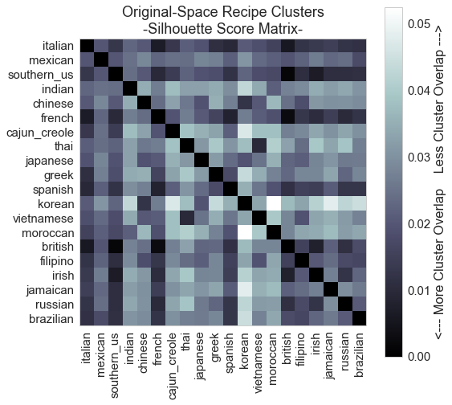
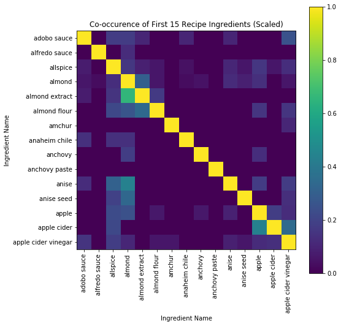

# Classification of Cuisines using Recipe Ingredients - Final Report

### Table of Contents:
1. [Introduction](#Introduction)
2. [Data Acquisition/Cleaning](#Data)
3. [Data Exploration](#EDA)
4. [Analysis Summary](#Findings)
5. [Multinomial Classification Models](#Models)
6. [Recommendation Engines](#Engine)
7. [Conoclusions and Next Steps](#Conclusions)
7. [Resources](#Resources)

## 1. Introduction <a class="anchor" id="Introduction"></a>

Problem: Food is a massive and complex arena in which culture, geography, climate, and social factors combine to create unique cuisines around the world. With the age of the internet, millions of recipes are now shared instantly and easily accessible. Many ingredients previously specific to certain regions of the world are now also widely available due to online commerce. 

**Objectives**

With this dataset, provided by Yummly, I aim to answer the following questions:

1. **What are the ingredients uniquely used or combined that make up the “signatures” of particular cuisines?**
2. **Can we learn more about the origins of cuisine by analyzing their ingredients to provide insights into the cultures and regions from which they originate?**

**Client**

The client for this project would be a recipe-hosting website, such as Yummly. Being able to intelligently group recipes into cuisine categories could improve new recipe discovery and engagement for their users. Some applications of a model that can group cuisines include recommendation of a cuisine based on available ingredients, or suggested pairings of spices and or other ingredients based on ingredients that are frequently used together.

**Broader Impact**

Beyond directly providing the capability to categorize cuisines based on their ingredients, analysis of this data can provide valuable insight into the evolution of cuisines. If it can be coupled with feedback from a community, such as from users that use and rate the recipe quality on Yummly, it has the potential to be used to create new recipes that intelligently combine ingredients to produce suggestions for promising yet unexplored recipes.

## 2. Data Acquisition/Cleaning <a class="anchor" id="Data"></a>

#### Objectives

1. Load the data and extract general info and structure
2. Deal with outlier values in recipe ingredients
3. Export cleaned version of dataset for further exploration and analysis

### 2.1 Load Original Dataset

The dataset that I am working with can be found in the "data" folder of this repository (filename is train.json), or from its origin at the site for [Kaggle's "What's Cooking?" Competition](https://www.kaggle.com/c/whats-cooking).

To start, the dataset was loaded from a json file into a dataframe so that it could be viewed and modified as needed. Below is the information on the original dataset.


```python
data.info()
```

    <class 'pandas.core.frame.DataFrame'>
    RangeIndex: 39774 entries, 0 to 39773
    Data columns (total 3 columns):
    cuisine        39774 non-null object
    id             39774 non-null int64
    ingredients    39774 non-null object
    dtypes: int64(1), object(2)
    memory usage: 932.3+ KB
    


```python
# Count how many duplicate rows appear in the dataset
data.duplicated(subset='id').sum()
```


    0


We can see that the data is relatively clean with no apparent null entries, and apparently free of duplicate entries. We can now check what each entry of the data looks like.


```python
# Preview first few rows of data
data.head(10)
```


<div>
<table border="1" class="dataframe">
  <thead>
    <tr style="text-align: right;">
      <th></th>
      <th>cuisine</th>
      <th>id</th>
      <th>ingredients</th>
    </tr>
  </thead>
  <tbody>
    <tr>
      <th>0</th>
      <td>greek</td>
      <td>10259</td>
      <td>[romaine lettuce, black olives, grape tomatoes...</td>
    </tr>
    <tr>
      <th>1</th>
      <td>southern_us</td>
      <td>25693</td>
      <td>[plain flour, ground pepper, salt, tomatoes, g...</td>
    </tr>
    <tr>
      <th>2</th>
      <td>filipino</td>
      <td>20130</td>
      <td>[eggs, pepper, salt, mayonaise, cooking oil, g...</td>
    </tr>
    <tr>
      <th>3</th>
      <td>indian</td>
      <td>22213</td>
      <td>[water, vegetable oil, wheat, salt]</td>
    </tr>
    <tr>
      <th>4</th>
      <td>indian</td>
      <td>13162</td>
      <td>[black pepper, shallots, cornflour, cayenne pe...</td>
    </tr>
    <tr>
      <th>5</th>
      <td>jamaican</td>
      <td>6602</td>
      <td>[plain flour, sugar, butter, eggs, fresh ginge...</td>
    </tr>
    <tr>
      <th>6</th>
      <td>spanish</td>
      <td>42779</td>
      <td>[olive oil, salt, medium shrimp, pepper, garli...</td>
    </tr>
    <tr>
      <th>7</th>
      <td>italian</td>
      <td>3735</td>
      <td>[sugar, pistachio nuts, white almond bark, flo...</td>
    </tr>
    <tr>
      <th>8</th>
      <td>mexican</td>
      <td>16903</td>
      <td>[olive oil, purple onion, fresh pineapple, por...</td>
    </tr>
    <tr>
      <th>9</th>
      <td>italian</td>
      <td>12734</td>
      <td>[chopped tomatoes, fresh basil, garlic, extra-...</td>
    </tr>
  </tbody>
</table>
</div>


There are three columns presented above:

**cuisine** - indicates the category of cuisine for a particular recipe  
**id** - unique recipe ID number  
**ingredients** - contains a list of ingredients for the respective entry  

The main columns of interest here are the cuisine and ingredients categories. To begin, we should inspect the contents of each. Below is a list of all cuisine categories that appear in the dataset.


    Cuisine Categories in the dataset (by occurence):
    italian         7838
    mexican         6438
    southern_us     4320
    indian          3003
    chinese         2673
    french          2646
    cajun_creole    1546
    thai            1539
    japanese        1423
    greek           1175
    spanish          989
    korean           830
    vietnamese       825
    moroccan         821
    british          804
    filipino         755
    irish            667
    jamaican         526
    russian          489
    brazilian        467
    Name: cuisine, dtype: int64
    
    There are 20 cuisine categories represented in this dataset.
    


We can see that some categories, such as Italian and Mexican Cuisines occupy much larger fractions of the data, but overall there aren't any cuisines with overly small amounts of recipes represented here.

Next we will take a look at the ingredient details. First, we will look at the statistics of overall length of the ingredients list for each entry.


    count    39774.000000
    mean        10.767713
    std          4.428978
    min          1.000000
    25%          8.000000
    50%         10.000000
    75%         13.000000
    max         65.000000
    dtype: float64
    
     Median Value: 10.0
    


There is quite a large variation in the number of ingredients per recipe, with a maximum of 65 in this dataset. The average tends to be about 10 ingredients per recipe. Surprisingly, there are recipes with only 1 ingredient! We can see the ingredients for these below.


    japanese ['sushi rice']
    vietnamese ['dried rice noodles']
    indian ['plain low-fat yogurt']
    indian ['unsalted butter']
    japanese ['udon']
    thai ['sticky rice']
    indian ['butter']
    mexican ['corn tortillas']
    thai ['grained']
    southern_us ['lemonade concentrate']
    thai ['jasmine rice']
    indian ['unsalted butter']
    italian ['cherry tomatoes']
    french ['butter']
    indian ['cumin seed']
    french ['haricots verts']
    mexican ['vegetable oil']
    spanish ['spanish chorizo']
    spanish ['sweetened condensed milk']
    japanese ['water']
    greek ['phyllo']
    indian ['unsalted butter']
    

Now we can look at some more details of the ingredients we are working with. We will look at the total list of all ingredients in the data.


    Number of unique ingredients in the dataset: 6714
    Number of total ingredients in the dataset: 428275
    
    Ingredients ranked by occurence in the data:
    salt                                          18049
    onions                                         7972
    olive oil                                      7972
    water                                          7457
    garlic                                         7380
    sugar                                          6434
    garlic cloves                                  6237
    butter                                         4848
    ground black pepper                            4785
    all-purpose flour                              4632
    pepper                                         4438
    vegetable oil                                  4385
    eggs                                           3388
    soy sauce                                      3296
    kosher salt                                    3113
    green onions                                   3078
    tomatoes                                       3058
    large eggs                                     2948
    carrots                                        2814
    unsalted butter                                2782
    ground cumin                                   2747
    extra-virgin olive oil                         2747
    black pepper                                   2627
    milk                                           2263
    chili powder                                   2036
    oil                                            1970
    red bell pepper                                1939
    purple onion                                   1896
    scallions                                      1891
    grated parmesan cheese                         1886
                                                  ...  
    lamb rib roast                                    1
    bird pepper                                       1
    tuna, drain and flake                             1
    Jonshonville® Cajun Style Chicken Sausage        1
    frozen sweetened raspberries                      1
    BACARDI® Superior                                1
    angled loofah                                     1
    dried pineapple                                   1
    semisweet vegan chocolate chips                   1
    peppermint schnapps                               1
    rock cornish game hens                            1
    boneless skinless chicken thigh fillets           1
    sliced mango                                      1
    garlic olive oil                                  1
    cubed mango                                       1
    San Marzano Diced Tomatoes                        1
    japanese style bread crumbs                       1
    fat-trimmed beef flank steak                      1
    puff pastry cups                                  1
    arepa flour                                       1
    fresno pepper                                     1
    shredded low-fat cheddar                          1
    jumbo shell pasta , cook and drain                1
    bean curd stick                                   1
    wasabe                                            1
    sweet chorizo                                     1
    A Taste of Thai Rice Noodles                      1
    butter flavor shortening                          1
    diced mushrooms                                   1
    italian style rolls                               1
    Length: 6714, dtype: int64
    


We can see that while salt is almost ubiquitous, less than half of our ingredients show up more than a few times each. This will need to be addressed, since it may make building a predictive model very difficult. One reason for this is that many similar ingredients have many variants, as is shown below for ingredients containing "Turkey".


    turkey breast steaks: 1
    turkey salami: 1
    turkey ham: 1
    sliced turkey: 6
    lean ground turkey: 26
    rich turkey stock: 1
    hot italian turkey sausage: 2
    boneless turkey breast: 3
    ground turkey sausage: 1
    turkey tenderloins: 11
    smoked turkey breast: 5
    turkey carcass: 2
    turkey burger: 1
    low fat mild Italian turkey sausage: 1
    Italian turkey sausage: 54
    turkey sausage links: 3
    turkey meatballs: 1
    turkey kielbasa: 18
    turkey gravy: 1
    sweet turkey sausage: 1
    whole turkey: 1
    turkey giblet stock: 1
    turkey thigh: 2
    ground turkey breast: 39
    smoked turkey: 16
    ground turkey: 168
    cooked turkey: 48
    Italian turkey sausage links: 2
    turkey breast deli meat: 2
    roast turkey: 10
    turkey: 62
    dark turkey meat: 1
    turkey sausage: 15
    turkey hot dogs: 1
    smoked turkey drumstick: 1
    turkey breast tenderloins: 2
    fat free ground turkey breast: 1
    turkey mince: 1
    turkey legs: 9
    seasoned ground turkey: 1
    low-fat turkey kielbasa: 1
    turkey stock: 9
    turkey bacon: 12
    boneless skinless turkey breasts: 1
    turkey breast cutlets: 10
    hot italian turkey sausage links: 4
    turkey broth: 6
    smoked turkey sausage: 13
    turkey breast: 25
    turkey breakfast sausage: 4
    turkey meat: 15
    andouille turkey sausages: 2
    skinless boneless turkey breast halves: 1
    Number of Turkey variations: 53
    Total times ingredients with Turkey were used: 626
    

We can see that although turkey appears more than 600 times in the dataset, there are over 50 variants of turkey in the ingredient set, and most are only present a few times. In addition, we cannot simply set all variants to be labeled as "Turkey" since some, such as turkey stock are only flavorings and do not include any of the original turkey meat.

In order to deal with these variants, several (or many) steps will need to be taken.

### 2.2. Dealing with outliers (the messy part)

The next section will be a bit messy with many iterations in place to converge on a final set of ingredients. Hopefully my explanations will make a clear throughline to follow.

* First, I will take each ingredient from our ingredient_rankings (which is an ordered form of our unique ingredients set) and extract only the nouns. This means that 'chopped ingredient', 'fresh ingredient', 'baked ingredient' etc. will be converted to 'ingredient'.

* Next, I take only the singular form of each ingredient, so that there aren't unnecessary duplicates (e.g. 'onions' and 'onion')

Note: some words don't play nicely with NLTK's database of vocabulary (such as 'garlic', which tends to be classified as an adjective. e.g. 'garlic cloves' is simplified as 'clove') so I will include two lists of words for this process that will be updated throughout this section. They are **'words_to_exclude'** for words I do not want in my final list, and **'words_to_include'** for words that I do not want filtered out.

* Next, there are some ingredients in our dataset are either misspelled or incomplete in some way (e.g. 'any', 'extra', 'asian') we can deal with misspellings later, but first, we should make sure that some of the words that are falling through the cracks do not, such as 'flour', 'couscous', 'pudding', etc.

After these processing steps, the data has been transformed to what is shown below:


          original ingredients     simplified
    0                     salt           salt
    1                   onions          onion
    2                olive oil      olive oil
    3                    water          water
    4                   garlic         garlic
    5                    sugar          sugar
    6            garlic cloves   garlic clove
    7                   butter         butter
    8      ground black pepper         pepper
    9        all-purpose flour          flour
    10                  pepper         pepper
    11           vegetable oil  vegetable oil
    12                    eggs            egg
    13               soy sauce      soy sauce
    14             kosher salt           salt
    15            green onions          onion
    16                tomatoes         tomato
    17              large eggs            egg
    18                 carrots         carrot
    19         unsalted butter         butter
    20            ground cumin          cumin
    21  extra-virgin olive oil      olive oil
    22            black pepper         pepper
    23                    milk           milk
    24            chili powder   chili powder
    25                     oil            oil
    26         red bell pepper    bell pepper
    27            purple onion          onion
    28               scallions       scallion
    29  grated parmesan cheese         cheese
    
    After 1st Step: Unique ingredients reduced from 6714 to 4446
    

Ok! So after these processing steps we've dropped about 2,200 ingredients (1/3 of our original set!), but there is still a long way to go. 

* Next, we check to see if there are any spelling errors causing variations in our ingredient set.

For this step, we have several sources of misspelled words. There are words originating from other languages such as *'edamame'* and *'arborio'*.

We also have some words that are brand-related, such as *'lipton'*, *'smithfield'* and *'knorr'*.

Finally, in addition to the normal misspellings (e.g. *cheesi* instead of cheese or cheesy) there are many misspelling entries that have special characters, such as *'johnsonvilleâ®'* and *'crã¨me fraã®che'*. These are the easiest to deal with since we can simply remove all words that are not strictly composed of alphabetic characters.

The following steps were taken to deal with misspelled words: 

1. the words with non-alphabetic characters have been removed
2. remove the brand-related words by adding them into the 'words_to_exclude' list
3. check the misspelled words left, along with their frequency in the list of ingredients

The number of misspelled ingredients remaining are shown below:


    Number of total misspellings occuring in simple_ingredients4: 701
    misspell_errors list exported to .txt file!
    

There are a lot of entries in the misspelled ingredients. This presents a dilemma, since it's too long to go through by hand, and the strange nature of of many of the words not being strictly English makes them difficult to be interpreted correctly by a local spell-checker. No worries, Google's spell checker to the rescue! The workflow for this step is going to require some manual labor (until I find a way to do this within the script). The steps are as follows:

1. Export the list of misspellings to a txt file (completed above)
2. Import the list into a google doc manually
3. Use google doc spell checker to quickly run through and make corrections where possible
4. Export google doc as .txt file in the data folder ('data/misspells_corrected.txt')
5. Import .txt file into list and create a dictionary of misspelled words to corrected versions for quick replacement

Using Google's spell check, I was able to complete these steps in less than 5 minutes total, which is in my opinion an superb return on time efficiency for around 700 entries in multiple languages. Now we can replace the misspelled entries with the corrected versions using the dictionary that has been built.

Now that we have run through quite a few of our options in removing errors and combining ingredients via several methods, we see that we still have about 4,000 ingredients in our list (60% of our original ingredients!). But which of these are useful to our analysis? Next I remove outliers in the dataset for ingredients that only appear a few times within the ~40k recipes.


    Number of unique ingredients in simplified dataset: 4068
    Number of unique ingredient words: 2081
    

Although we still have about 4,000 ingredients in our dataset, we can see that only 2,000 ingredient words appear in the data. Additionally, we can compare the distribution of ingredients before and after our processing of the data.


    Top 10 most common original ingredients:
    salt                   18049
    onions                  7972
    olive oil               7972
    water                   7457
    garlic                  7380
    sugar                   6434
    garlic cloves           6237
    butter                  4848
    ground black pepper     4785
    all-purpose flour       4632
    pepper                  4438
    vegetable oil           4385
    eggs                    3388
    soy sauce               3296
    kosher salt             3113
    green onions            3078
    tomatoes                3058
    large eggs              2948
    carrots                 2814
    unsalted butter         2782
    dtype: int64
    
    Top 20 most common ingredients (simplified):
    salt             21122
    pepper           17106
    onion            16700
    olive oil        10625
    garlic            9451
    water             8716
    sugar             8629
    butter            7927
    egg               7186
    garlic clove      7076
    flour             6902
    tomato            6477
    ginger            4680
    soy sauce         4470
    vegetable oil     4385
    milk              4029
    cheese            3939
    cumin             3678
    bell pepper       3505
    carrot            3126
    dtype: int64
    


    Number of ingredients that appear more than 40 times (0.1% of entries in data): 733
    Number of words that appear more than 40 times (0.1% of entries in data): 610
    

Now that the ingredients have been simplified and consolidated, we can see that the number of ingredients that appear in more than 0.1% of data entries (40 times) is about 700, while the number of words that appear above the same threshold is about 600. We can now move to creating a dataset that holds only these ingredients for export.

This dataset will be what is used for exploration and analysis, and has the following 4 columns:

**id** - the unique identification number for each recipe  
**cuisine** - the category label of the recipe cuisine  
**ingredients** - a simplified list of ingredients, processed by the steps above (with outliers removed)  
**words** - a list of unique words that appear in the ingredients list (with outliers removed)  

Additionally, since come of the ingredients lists may have been emptied if they only contained non-noun words or symbols, we must removed these rows before exporting our dataset.


    Number of rows dropped from dataset: 17
    

Only 17 rows needed to be removed from the dataset, and now it is ready for export. The new dataset will be exported as **data_clean.pkl** to the data folder.


    <class 'pandas.core.frame.DataFrame'>
    Int64Index: 39757 entries, 10259 to 2362
    Data columns (total 3 columns):
    cuisine        39757 non-null object
    ingredients    39757 non-null object
    words          39757 non-null object
    dtypes: object(3)
    memory usage: 1.2+ MB
    

## 3. Data Exploration <a class="anchor" id="EDA"></a>


<div>
<table border="1" class="dataframe">
  <thead>
    <tr style="text-align: right;">
      <th></th>
      <th>cuisine</th>
      <th>ingredients</th>
      <th>words</th>
    </tr>
    <tr>
      <th>id</th>
      <th></th>
      <th></th>
      <th></th>
    </tr>
  </thead>
  <tbody>
    <tr>
      <th>10259</th>
      <td>greek</td>
      <td>[feta cheese crumbles, olive, grape tomato, on...</td>
      <td>[pepper, crumbles, olive, lettuce, tomato, rom...</td>
    </tr>
    <tr>
      <th>25693</th>
      <td>southern_us</td>
      <td>[corn meal, milk, thyme, flour, salt, tomato, ...</td>
      <td>[meal, milk, thyme, vegetable, flour, salt, to...</td>
    </tr>
    <tr>
      <th>20130</th>
      <td>filipino</td>
      <td>[garlic powder, salt, cooking oil, onion, chic...</td>
      <td>[mayonnaise, powder, soy, salt, onion, chicken...</td>
    </tr>
    <tr>
      <th>22213</th>
      <td>indian</td>
      <td>[water, salt, vegetable oil]</td>
      <td>[wheat, vegetable, salt, water, oil]</td>
    </tr>
    <tr>
      <th>13162</th>
      <td>indian</td>
      <td>[milk, bay leaf, shallot, chili powder, garlic...</td>
      <td>[leaf, masala, onion, garam, cayenne, yogurt, ...</td>
    </tr>
  </tbody>
</table>
</div>


The **ingredients** column provides a list of ingredients, while the **words** column provides us with a unique set of words found in each respective ingredients list. We will use both columns for analysis.

### 1. What are the most frequently used ingredients in each cuisine?

We can get an idea of the ingredients used in each cuisine by splitting ingredients and words by categories.


```python
cuisines[1].head()
```


<div>
<table border="1" class="dataframe">
  <thead>
    <tr style="text-align: right;">
      <th></th>
      <th>cuisine</th>
      <th>ingredients</th>
      <th>words</th>
    </tr>
    <tr>
      <th>id</th>
      <th></th>
      <th></th>
      <th></th>
    </tr>
  </thead>
  <tbody>
    <tr>
      <th>16903</th>
      <td>mexican</td>
      <td>[pepper, jalapeno pepper, corn tortilla, salt,...</td>
      <td>[cilantro, tortilla, fresh, poblano, olive, ch...</td>
    </tr>
    <tr>
      <th>41995</th>
      <td>mexican</td>
      <td>[cilantro, coriander, chili powder, cinnamon, ...</td>
      <td>[cilantro, powder, coriander, flank, olive, ch...</td>
    </tr>
    <tr>
      <th>40523</th>
      <td>mexican</td>
      <td>[cilantro, salt, rom tomato, lime, onion, jala...</td>
      <td>[cilantro, pepper, salt, tomato, lime, onion, ...</td>
    </tr>
    <tr>
      <th>1299</th>
      <td>mexican</td>
      <td>[cheese, flour tortilla, egg]</td>
      <td>[tortilla, flour, sausage, cheese, egg]</td>
    </tr>
    <tr>
      <th>10276</th>
      <td>mexican</td>
      <td>[garlic powder, chili powder, sea salt, cumin,...</td>
      <td>[powder, sea, chili, salt, cumin, onion, papri...</td>
    </tr>
  </tbody>
</table>
</div>


We will use a collection of wordclouds since: 1) They are a pretty good way to visualize the most common ingredients found in any subset of our data, and 2) They are really fun.

Below is a preview of the collection of wordclouds generated from their respective ingredients lists.


There are a few things we can see by looking briefly through the wordclouds above. Firstly, ingredients like salt and onions seem to be ubiquitous, represented in every cuisine of our dataset. Alternatively, there are some clearly unique ingredients widely used in some cuisines, such as cumin in Mexican recipes. These standouts may definitely help us to build a model of cuisine prediction later on, if they can be weighted more importantly than those which appear in all cuisines.

We can also see rankings of the average lengths of ingredients lists for each cuisine to get an idea of which cuisines enjoy more complex dishes than others.


It looks like cuisines like Moroccan, Indian and Thai use the most ingredients per recipe, while British, Irish and Brazilian cuisines have slightly simpler recipe lists.

It may also be useful to see which cuisines use the widest variety of ingredients to get an idea of the breadth of ingredients or flavors that make up each cuisine.


We can see that although Moroccan, Indian and Thai lead with the most ingredients per recipe, the kitchens of Mexican, Italian and Southern U.S. cuisines are stocked with a larger variety of ingredients in our dataset. In all cases, Brazilian cuisine tends to be a simpler affair.


### Preparing data for Vectorization (TF-IDF weighted Processing)

While the visualizations above are nice, ubiquitous ingredients such as onion, salt, and garlic tend to obscure the ingredients unique to each cuisine. In order to account for this distribution and extract the ingredients that form a "signature" of each cuisine, we will use TF-IDF weighting which will give higher importanct to words which mainly appear in their respective category, and not across many cuisines.

Before we can proceed to apply this weighting to our cuisine ingredient lists, the ingredient lists for recipes of each cuisine will be normalized to be approximately the same length to adjust for cuisines that have a wide difference in the number of recipes represented. We will choose a random sample set of 20,000 ingredients for each cuisine for our analysis (the mean ingredients for all recipes is ~10, so this approximates about 2,000 recipes each).


The plots above show us a much better representation of which ingredients form the unique signature of each cuisine. We can also use this grouping to see how similar cuisines are, as shown below.


Great! Although we've input nothing beyond labels and recipe ingredients, we can see that the visualization has naturally grouped together cuisines that are similar! Geography seems to play a role, since many Eastern and Western countries are grouped closely, and we can see the cuisines that best bridge the gap between these two, such as Filipino and Indian cuisines!

Now that we seem to have isolated the valuable data, we can return to our wordclouds and generate wordclouds that accurately depict the signature ingredients of each cuisine.


### TF-IDF for each recipe

Now that we have looked at ingredients grouped together by their cuisine, we can perform a similar representation and visualization by processing each recipe individually into a TF-IDF weighted format.


    <39757x720 sparse matrix of type '<class 'numpy.float64'>'
    	with 267634 stored elements in Compressed Sparse Row format>


This time, instead of just projecting the data onto 2 dimensions, we will compress the data onto about 100 dimensions and then feed that into a t-SNE algorithm. This algorithm will plot the data onto a 2-dimensional space that we can try to use to visualize if cuisine recipes can be grouped together without explicit labelling.


We can see above that there are some nice groupings for most of the data above! The algorithm has done a good job representing each individual recipe with its associated cuisine. There is still room for improvement here though, since several of the cuisines with less entries such as British, Irish, Russian, etc. Are still quite spread out.

There are two corrections we can make to attempt to fix this. First, the distribution of recipes should be equalized, so that each cuisine is represented an approximately equal amount. Second, This model still includes ubiquitous ingredients such as Salt, Onion, Garlic, etc.! These entries should be excluded, similar to the previous work that was done during building of the tf-idf model. Making these corrections are likely to improve the groupings of recipes performed by t-SNE.

### PCA projection mapping of recipes

We can also try to side-step any issues that the t-SNE algorithm may be having in attempting to cluster our recipes by using simpler dimensionality reduction method such as PCA to analyze the clustering of recipes ourselves. PCA will only project the data onto dimensions linearly using principal components (those directions along which there is the most variance in the data). What we lose in clustering potential from t-SNE, here we can gain in interpretability where we can perform further analysis.


### PCA Cluster Analysis

By looking at the PCA projection plot above, we can see that there is again some natural clustering of the data once each recipe is labeled by its respective cuisine. By analysing these clusters using silhouette analysis, we can get more insight into both our cuisines and the relationships that they share between one another.


Above we have a matrix representation of the average silhouette scores between each pair of cuisines. The darker squares represent cuisines that, when all recipes on our PCA plot are compared, have a large overlap in their clusters. The lighter squares, conversely, have clusters that are well separated from each other.

While we can make some inferences at this point about the distinctness of each cuisine by using the heatmap above, it must be noted that the heatmap was generated from our previous PCA projection of the data onto 2 dimensions. While 2-dimensional data makes it easier for us humans to visualize the data, there is information lost in doing this, and the clusters may overlap in ways that they would not otherwise in their original (716-dimensional!) space in our TF-IDF matrix. Thankfully, we can perform the same analysis on our clusters without being able to visualize the data.

### Cluster Analysis in Original TF-IDF Matrix Space



The picture we get now has a bit of a different story from the one we form from our PCA data, though there are valuable details to extract. If we look at the darker squares for any cuisine pair, we get a sense of the overlap in their clusters. As we have seen multiple times before in this dataset, there seems to be a strong geographic relationship between cuisines. The pairs of highest overlap for British recipes, for example, lies with Italian, Southern U.S., French, and Irish cuisines, while cuisines such as Thai, Korean and Vietnamese have notably less overlap with the British recipes.

Below are the cuisine pairs with the most and least overlap to get a better idea of which cuisines are most alike.


Additionally from our silhouette score matrix, we can see that some cuisines such as Italian, Southern U.S. and French seem to have higher overlap with other cuisines overall than others like Korean. We can use the average values of the cuisine overlap to get an idea of how general vs. distinct any cuisine is in our dataset.


As we saw ealier, it seem as if cuisines like Italian and Southern U.S. have a spread that overlaps more with other cuisines than cuisines like Indian and Korean which are the most distinct from other cuisines on average. There could be many factors that makes the recipe profiles of certain cuisines overlap highly with other. It could be due to a wide flavor profile that the cuisine has adopted over time, or alternatively it might be an indication of historical influence that the cuisine has had on other cuisines that has caused other cuisines to adopt the flavors of the original cuisine.

### Ingredient Pairings (Co-occurence)

Now that we've looked at how cuisines relate to one another, as well as analyzed the relationships between recipes within these cuisines, we can take a look at how the ingredients themselves relate. This will be done by looking at the number of times each ingredient is seen together with other ingredients in any given recipe. The result will be a co-occurence matrix, as shown below.




In both of the examples above, the co-occurence values have been scaled by the square root of their value to increase visibility on the map while preserving their ranking with respect to each other.

The matrix is formed such that for each row (ingredient), the corresponding ingredient column values are the fraction of recipes that the complimentary ingredients were seen with the row ingredient. This matrix format is pretty nice, since it gives us a new perspective to analyze our ingredients.


The two plots above show us the most and least complimentary ingredients, as ranked by their average co-occurence with other ingredients. The main takeaways from these plots are that ingredients with very high average co-occurenes are paired frequently with many other ingredients, so they are likely to generalize well to different sets of ingredients and flavors.

Conversely, the least complimentary ingredients did not show up very often in our dataset with many other ingredients, so there may only be a small subset of ingredients that compliment them, and they may not pair well with most flavors or ingredients.

## 4. Analysis Summary <a class="anchor" id="Findings"></a>

In this project the Yummly recipe dataset was investigated with a wide range of metrics to explore and analyze the attributes of various cuisines. The ingredients that make up a cuisines "signature" were identified for each cuisine, exposing what makes the flavors of each cuisine unique.

#### Cuisines

Overall, the analysis showed that the make up of cuisines is also related, in part, to geography. Cuisines from Eastern countries such as China, Korea, and Japan were shown to share a relatively common makeup of ingredients, while Western-based cuisines such as French, Irish and British were also similar. This analysis was also able to extract some information for cuisines that are mixed, which could be an indicator of their origins, such as is seen in Filipino cuisines, which were shown to fall somewhere in between Eastern and Western cuisines. This is not without base, since the Phillipines, while geographically located near the Eastern countries, was long colonized and controlled by the Spanish ([see this link for further information](https://en.wikipedia.org/wiki/History_of_the_Philippines_(1521%E2%80%931898)). Viewed from this perspective, deeper results from this dataset have the potential to yield "genomic" data of cuisines, tracing their origins and history.

#### Recipes

Recipes were analyzed individually and natural clusters were seen when projected onto 2-dimensional spaces using SVD, PCA and t-SNE techniques. Cluster analysis revealed the following about each cuisine:

1. Cuisines were again shown to have clusters that overlapped closely to each other based partly on geographic relationships
2. Some cuisines, such as Italian and Southern U.S., had large spreads and overlapped with other cuisines frequently.
3. Other cuisine recipes, such as Korean, were on average much more distinct from others which could indicate some measure of "uniqueness".

#### Ingredients

For the final scale of granularity in the analysis, each ingredient was analyzed in its relationship to other ingredients. A matrix of co-occurrence was built in order to provide a measure to how frequently each ingredient was paired with others. Some ingredients, such as Cumin and Carrots, were found to have the highest average co-occurrences with other ingredients. This may indicate that these ingredients have flavors that generalize and pair very well with a wide variety of ingredients. This information can also be used to gain insight into the most popular pairings of ingredients within the dataset, both within a cuisine and worldwide.

## 5. Multinomial Classification Models <a class="anchor" id="Models"></a>

Now that the data has been explored visually from several different angles, the next step will be to build a model in attempts to predict the cuisine of a recipe given its ingredients. The TF-IDF feature representation of ingredients will be used as the base input for predictive models. The problem is a multinomial classification problem, with 20 cuisine classes being considered.

Several models will be implemented and compared for the following candidates:

1. **Multinomial Naive Bayes** - classifier based on applying Bayes theorem (with strong independence assumptions) between features
2. **Logistic Regression** - classification algorithm that performs the best fit of a linear decision boundary between classes
3. **Random Forests** - decision tree algorithm that averages effects from randomly selected subsets of features to create a regularized decision boundary
4. **Extremely Randomized Trees** - algorithm that further randomizes compared to random forests by considering randomly selecting splits
5. **Gradient Boosting** - Another variation on the decision tree in which many shallow trees are used as the learning process instead (high bias, low variance) vs. deep trees such as in random forests (high variance, low bias)

The models will be compared primarily by their averaged F1 score, which is a metric that takes into account True Positive, False Positive, True Negative and False Negative accuracy parameters. The equation for F1 score is as follows:

    F1 = 2 * (precision * recall) / (precision + recall)  
    
where **precision** is the fraction of true positives divided by the total number of true positives and false positive fradulent values and **recall** represents the number of true positives divided by the number of true positives and false negative values.  

Below is the structure of the data we are feeding in, which is a sparse matrix of TF-IDF weights that we generated in the previous section.


    <39757x720 sparse matrix of type '<class 'numpy.float64'>'
    	with 267634 stored elements in Compressed Sparse Row format>


Now that the sparse matrix is created, we will select splits for training, CV and test sets for our models.


    Number of training entries: 23853 -> 60% of data
    Number of CV entries: 7952 -> 20% of data
    Number of test entries: 7952 -> 20% of data
    

Now we can fit the recipes to cuisine classes using our models. To start, I will use a dummy model to obtain a baseline performance that we can use for comparison with other models.


                  precision    recall  f1-score   support
    
       brazilian       0.02      0.02      0.02        85
         british       0.01      0.01      0.01       169
    cajun_creole       0.04      0.04      0.04       299
         chinese       0.07      0.08      0.07       531
        filipino       0.02      0.02      0.02       150
          french       0.06      0.06      0.06       549
           greek       0.03      0.02      0.03       245
          indian       0.07      0.07      0.07       596
           irish       0.01      0.02      0.01       130
         italian       0.21      0.19      0.20      1621
        jamaican       0.02      0.02      0.02        92
        japanese       0.05      0.04      0.05       295
          korean       0.03      0.03      0.03       160
         mexican       0.17      0.17      0.17      1254
        moroccan       0.02      0.02      0.02       181
         russian       0.01      0.01      0.01       105
     southern_us       0.11      0.11      0.11       817
         spanish       0.03      0.02      0.02       209
            thai       0.03      0.03      0.03       316
      vietnamese       0.02      0.02      0.02       148
    
     avg / total       0.10      0.10      0.10      7952
    
    

    Overall accuracy of dummy model: 9.86 %
    

The dummy model is the simplest version of a classifier that we can use to gauge performance versus our ensemble of chosen model candidates. As we can see, the average F1 score is about 0.1, which means that our classifier is neither precise nor robust. The overall accuracy is about 10%, which is only slightly better than random guessing. Now we can test our models against this and hope for better results!


    Dummy model average F1-score: 0.10
    Multinomial Naive Bayes model average F1-score: 0.69
    Logistic Regression model average F1-score: 0.73
    Random Forest model average F1-score: 0.66
    Extremely Randomized Trees model average F1-score: 0.69
    Gradient Boosting model average F1-score: 0.69
    


Looking at our baseline, it seems that Logistic Regression, Naive Bayes and Gradient Boosting models are the top performers, but we still require more optimization to get an idea of which model is most suitable for our data.


    Multinomial Naive Bayes model average F1-score: 0.69
    Logistic Regression model average F1-score: 0.69
    Random Forest model average F1-score: 0.70
    Extremely Randomized Trees model average F1-score: 0.72
    Gradient Boosting model average F1-score: 0.70
    


    Total execution time : 49.3 minutes
    

After optimizing parameters for each of our models, we are able to push the performance up pretty much across the board. Our Extremely Randomized Trees model comes out on top with an F score of 0.72, so we will use this model to analyze our results when applied to the Test dataset, as shown below.


The strong presence of values along the diagonal indicate that the model mostly correctly classifies the given recipes, with no significant misclassification for even cuisines with smaller distributions of recipes such as Brazilian and Russian cuisines. The overall accuracy of the model is shown below.


    Overall accuracy of best model: 72.86 %
    

## 6. Recommendation Engines <a class="anchor" id="Engine"></a>

One particularly useful application of the analysis and processing that has been done on this dataset is generating recommendations for new recipes that users can try. I have used the data to build 2 recommendation engines:

#### 6.1 Similar Recipe Recommendations

This funtion takes in the recipe id of the recipe that the user tried, and perhaps has rated highly. It will return a number of recommendations defined in the function (default is 3) of recipes that are similar based on the nearest neighbors in the TF-IDF vector space. One example result is shown below:


```python
similar_cuisine_recommendations(4758)
```

    Your recipe:
          cuisine                                        ingredients
    id                                                              
    4758  italian  garlic clove, chicken broth, basil, flour, sal...
    
    
    Similar recipes you might be interested in:
           cuisine                                        ingredients
    id                                                               
    40073  italian  garlic clove, chicken broth, basil, tomato, on...
    44504  italian  chicken broth, basil, salt, butter, cheese, pe...
    26040  italian  basil, cheese, olive oil, tomato, sugar, garli...
    

The recipe suggestions use similar ingredients and are likely to appeal to the user! Next up is an application that provides functionality for Recipe Discovery.

#### 6.2 Recipe Discovery Engine

This function takes in the same input as the previous funtion did, but returns the nearest neighbors for a number of recipes (default is again 3) that are each of a different cuisine! One example run using the same example user recipe id is shown below:


```python
unique_cuisine_recommendations(23260)
```

    Your recipe:
           cuisine                                        ingredients
    id                                                               
    23260  italian  milk, chicken broth, basil, cheese, flour, sal...
    
    Searching...
    
    
    
    Try some of these new recipes you might enjoy!
               cuisine                                        ingredients
    id                                                                   
    37648  southern_us  chicken broth, margarine, biscuit, onion, cele...
    11935       korean  sesame oil, onion, sugar, flank steak, garlic,...
    4407          thai  medium shrimp, lemongrass, lime juice, salt, g...
    

Take a look at the cuisines of the recommended recipes. They are each unique from both the user's original recipe and each other's cuisine categories!

This function works by first only searching through the neighbors that are not the same cuisine category as the user's recipe. Once it finds the nearest available neighbor, it adds the recipe to a suggestion list and performs the search again, this time without either the user's cuisine or the 1st recommendation cuisine. This continues until the desired number of suggestions are acquired.

It's a great way for users to try recipes that are similar to their own, likely using some of the same ingredients and flavors, but from cuisines they may have never otherwise considered!

#### 6.3 Ingredient List-based Recipe Recommendation Engine

For this engine, I will take a list of ingredients (perhaps whatever the user has in their fridge and pantry at the moment) and suggest the nearest recipes that can make use of a similar set of ingredients.


```python
sample_list = ['chicken broth', 'margarine', 'biscuit', 'onion', 'celery', 'pepper', 'sage', 'egg']

ingredient_list_recommendations(sample_list)
```

    
    
    You can try these recipes!
    ------------------------------
    
    You have all of the ingredients needed to make this recipe!
    cuisine                                              southern_us
    ingredients    chicken broth, margarine, biscuit, onion, cele...
    Name: 37648, dtype: object
    ------------------------------
    
    If you buy: ['bacon', 'bell pepper']
    
    You can make:
    cuisine                                              southern_us
    ingredients    chicken broth, bacon, onion, celery, bell pepp...
    Name: 31111, dtype: object
    ------------------------------
    
    If you buy: ['flour', 'tomato', 'sugar', 'butter']
    
    You can make:
    cuisine                                              southern_us
    ingredients    chicken broth, flour, tomato, sugar, butter, p...
    Name: 2273, dtype: object
    ------------------------------
    

This makes use of our data by intelligently suggesting recipes that are closest to what the user has on hand, and is likely to make trips to the grocery store much simpler in order to spice up a meal!

#### 6.4 Complimentary Ingredients Recommendation Engine

Lastly, I will use the a measure of the co-occurence of ingredients in a recipe to recommend an ingredient that could be added to either a single ingredient(best ingredient pair) or to a list of ingredients (best ingredient list compliment). This can be a useful suggestion for users looking to spice up their favorite recipes with a new ingredient!


```python
sample_list = ['chicken broth', 'margarine', 'biscuit', 'onion', 'celery', 'pepper', 'sage', 'egg']

complimentary_ingredients(sample_list)
```

    Searching for compliments to the following ingredients:
    ['chicken broth', 'margarine', 'biscuit', 'celery', 'sage']
    
    This might go well with your ingredients!
    ['milk']
    


```python
complimentary_ingredients(['chicken'])
```

    Searching for compliments to the following ingredients:
    ['chicken']
    
    This might go well with your ingredients!
    ['ginger']
    


```python
complimentary_ingredients(['strawberry'], n_recommendations=3)
```

    Searching for compliments to the following ingredients:
    ['strawberry']
    
    This might go well with your ingredients!
    ['cream', 'vanilla extract', 'milk']
    

The engine seems to perform well in these tests, demonstrating how it can suggest an ingredient complimentary to a list of ingredients (perhaps inspiration for something new to add to an existing recipe), as well as single ingredients in case one is wondering what pairs well with their favorite protein or grain.

In addition, the engine can produce multiple recommendations, such as in the list of suggested complimentary ingredients given for strawberries. It looks as if the 3 complimentary ingredients given to us **"cream, vanilla extract, and milk"** could be the base of ingredients for a shake of some sort!

It should be noted that due to their exceptional ubiquitous use across all recipes, the following ingredients are not considered as suggestions for any of the engines built here:  

* sugar
* garlic, garlic clove
* salt
* olive oil
* tomato
* flour
* water
* pepper
* egg
* butter
* onion

Omission of these ingredients was a key part in stabilizing the performance of the engines, since these ingredients seem to dominate all others. Also, by removing these the recommendations that are given to the user are more likely to be insightful and meaningful, instead of just suggesting to a user that they could add some water or salt to compliment their recipes!

If you're interested in playing around with these engines with your own recipes and ingredients, check out the github link to the code **[here](https://github.com/emenriquez/Springboard-Coursework/blob/master/Capstone%20Project%202/Recommendation%20Engines%20-%20Cuisines.ipynb)**.

## 7. Conclusions and Next Steps <a class="anchor" id="Conclusions"></a>

#### Model Performance

Several models were applied to the task of classifying the recipe cuisines. Once optimized, all performed generally well as measured by their average F scores, which take into account the true and false positive and negative values for each class. Looking at a confusion matrix, we were able to visualize this performance and saw that there were no significant misclassifications for any of the cuisines.

#### Next Steps for Improvement

Although the models performed reasonably well, there is still much room for improvement. Firstly, some of the optimization tests I performed seemed to indicate that the final bottleneck for performance was the input features. The next step to improve results for all analysis and model development steps will be to furth optimize the selection and format of the input features using further text processing steps, in addition to trying out more options during building of the TF-IDF vectors that are the final input for the models.

#### Recommendation Engines

In addition to the exploratory analysis and modeling, the recommendation engines provided a great avenue to leverage the analysis of the data into functional applications that could appeal to users of the Yummly data. This included the following engines:

1. **Simple recommendation engine** - recommend the most similar recipes to a user's current recipe
2. **Recipe discovery engine** - recommend the most similar recipes to a user's current recipe that are from different cuisines unique from the user's original recipe cuisine.  
    Example: (User's recipe is Italian) "Here are 3 similar recipes from French, Irish, and Spanish cuisines."  
3. **Ingredient list-based recipe recommendation engine** - take the ingredients that a user has, and recommend recipes that can be made, along with suggestions for which additional ingredients they may need.
4. **Ingredient pairing recommendation engine** - take ingredients for a user's recipe and recommend ingredients that are likely to pair well based on how often they are used together in the dataset.

To improve on the demonstrated engine prototypes, adding additional data to this dataset such as recipe names in lieu of just id numbers, as well as user rating information for each recipe will aid greatly in building a more fleshed-out next version of the recommendation engines. There is an API available from Yummly which could serve as a source for both more data to expand on this set, as well as provide more information on user ratings, recipe names, and other recipe metadata that could greatly enhance the funcationality of the recommendation engines.

## 8. Resources <a class="anchor" id="Resources"></a>

* Yummly - [Homepage](https://www.yummly.com/), [API Information](https://developer.yummly.com/) 
* Dataset - [Kaggle's "What's Cooking?" Competition Site](https://www.kaggle.com/c/whats-cooking/data)
* Project Proposal - [github link](https://github.com/emenriquez/Springboard-Coursework/blob/master/Capstone%20Project%202/Project%20Proposal%20-%20Cuisines.md)
* Code (IPython Notebooks):
    * Data Cleaning - [github link](https://github.com/emenriquez/Springboard-Coursework/blob/master/Capstone%20Project%202/Data%20Wrangling%20-%20Cuisines.ipynb)
    * Data Exploration - [github link](https://github.com/emenriquez/Springboard-Coursework/blob/master/Capstone%20Project%202/EDA%20-%20Cuisines.ipynb)
    * Classification Models - [github link](https://github.com/emenriquez/Springboard-Coursework/blob/master/Capstone%20Project%202/Classification%20Models%20-%20Cuisines.ipynb)
    * Recommendation Engines - [github link](https://github.com/emenriquez/Springboard-Coursework/blob/master/Capstone%20Project%202/Recommendation%20Engines%20-%20Cuisines.ipynb)
